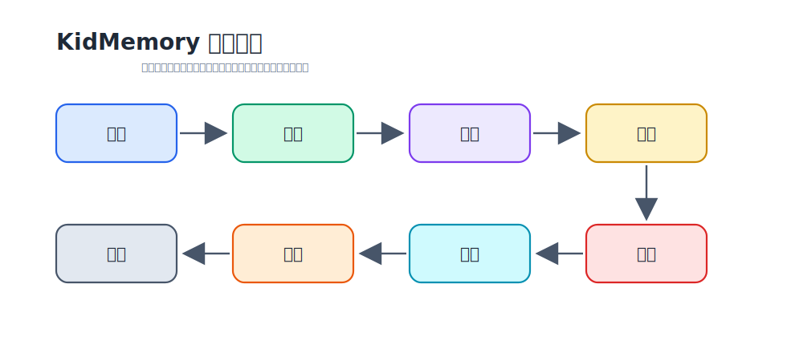
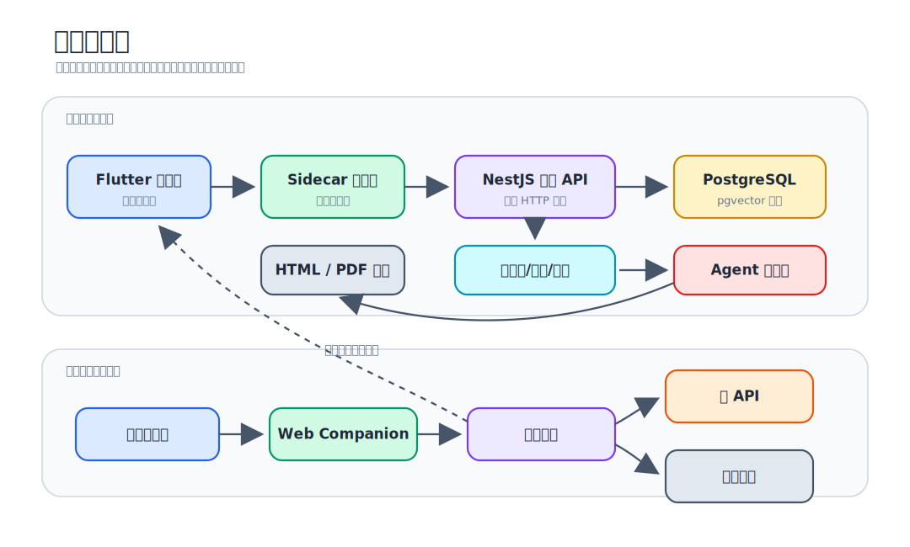

# KidMemory

<p align="center">
  <a href="README.md">中文</a> ·
  <a href="README_EN.md">English</a> ·
  <a href="https://kidmemory.baby/">官网</a>
</p>

<p align="center">
  
</p>

<p align="center">
  <strong>把孩子成长素材沉淀成可搜索、可编辑、可导出的家庭作品集</strong><br/>
  Local-first memory workspace for families, built for privacy and long-term ownership.
</p>

<p align="center">
  
  
  
  
  
</p>

## 产品定位

KidMemory 是一个本地优先的 AI 家庭记忆出版系统。它面向真实家庭资料流：孩子的画、照片、手工、笔记、语音转写和日常片段，帮助家长完成从收集、整理、检索到生成作品集的完整流程。

它不是普通相册，也不是模板套壳工具。产品目标是把零散成长素材沉淀为长期可保存、可搜索、可编辑、可打印、可分享的家庭记忆资产。

### 产品流程



- **Capture**：桌面导入文件，手机扫码上传照片和素材。
- **Curate**：维护孩子档案、素材元数据、标签、时间线和精选集合。
- **Search**：基于 PostgreSQL + pgvector 进行语义检索和素材定位。
- **Compose**：围绕主题、孩子、时间段和素材集合组织书稿上下文。
- **Generate**：在隔离 workspace 中运行 AI Agent，生成结构化 `book.json` 和 HTML。
- **Review**：家长在桌面端预览、检查、调整内容。
- **Publish**：导出 PDF、HTML 或后续可扩展的长图、打印书稿。
- **Archive**：保留本地数据、导出物和可迁移的协议化记录。

### 完整工作流程


桌面端覆盖初始化 / 设置、孩子档案、素材导入、素材库、搜索、生成 / 预览等主流程；移动端覆盖连接桌面端、上传素材、浏览 / 作品集等轻量协作场景。

### 核心能力

- **本地优先**：桌面端管理本地 sidecar 和内置 PostgreSQL runtime，家庭数据默认留在本机。
- **手机伴侣**：Web Companion 支持扫码连接、可信上传、浏览与分享。
- **AI 辅助出版**：AI 只负责整理和生成草稿，家长保留最终确认权。
- **协议统一**：sidecar、cloud-api、web、desktop 都通过 `packages/protocol` 消费接口类型。
- **可恢复和可迁移**：素材、孩子档案、导出物、OpenAPI 合约和生成产物都有清晰边界。

### 产品能力

- **孩子档案**：维护孩子基础信息、成长阶段、兴趣偏好和近期作品，为后续检索与生成提供稳定上下文。
- **素材库**：支持示例数据集导入、本地文件导入、拖拽导入、素材预览、元数据编辑、批量管理和删除。
- **语义检索**：基于 PostgreSQL + pgvector 建立素材索引，支持围绕主题、画面内容、时间和孩子档案进行素材定位。
- **手机上传**：Web Companion 提供扫码连接、可信上传会话、上传状态展示和桌面端回拉入库能力。
- **Agent 配置**：桌面端可配置 AI 服务、模型、工作目录和导出目录；sidecar 负责 readiness 检测和配置持久化。
- **Agent 生成**：sidecar 将孩子档案、素材、模板规则和用户意图整理为受控输入，在隔离 workspace 中运行 Agent，生成结构化 `book.json` 和可预览 HTML。
- **生成校验**：Agent 产物先经过 schema 和业务规则校验，再进入预览、导出和发布流程，避免未验证内容直接落地。
- **导出发布**：支持书稿预览、HTML/PDF 导出和导出目录管理，后续可扩展长图、打印书和更多分享格式。
- **安全边界**：Agent workspace 不直接访问数据库、密钥或对象存储；上传签名和云端 service role key 只保留在受信任后端。

### 桌面端 Agent 能力

- **内置 Skills**：sidecar 为书稿生成准备固定技能包和规则上下文，用于素材解读、故事编排、页面结构规划、风格约束和导出校验。
- **内置 MCP 工具**：sidecar 暴露受控 MCP 工具给 Agent 使用，包括素材读取、上下文检索、媒体处理、图片生成 / 渲染、导出相关工具和诊断工具。
- **受控 Workspace**：每次生成任务会创建独立 workspace，将 `input/`、规则、素材引用和模板上下文写入其中；Agent 只在 workspace 内读写产物。
- **结构化产物**：Agent 需要输出 `book.json`、`book.html` 等约定文件，sidecar 统一负责 schema 校验、预览转换和 PDF 导出。
- **工具权限隔离**：Agent 不能直接访问数据库、`.env`、Supabase service role key 或本机任意文件；需要通过 sidecar 提供的 API 和 MCP 工具间接读取受控数据。
- **桌面端可观测**：Flutter 侧负责展示 Agent 配置状态、生成进度、预览结果、导出结果和失败信息，便于家长在发布前检查。

## 本地开发快速开始

### 环境要求

- macOS，推荐 Apple Silicon。
- Node.js 22 或更高版本。
- Flutter stable，启用 macOS desktop。
- npm，Homebrew 可选。

桌面端开发路径不要求你手动启动系统 PostgreSQL。Flutter app 会拉起 sidecar，并由 sidecar 使用桌面端管理的 PostgreSQL + pgvector runtime。只有在独立调试 sidecar/cloud-api 时，才需要你自己提供 PostgreSQL。

### 1. 本地客户端配置

```bash
git clone https://github.com/xingbofeng/kidmemory.git
cd kidmemory
```

正常运行桌面客户端时不需要先准备 `.env`。客户端会启动 sidecar、管理本地 PostgreSQL + pgvector runtime，并在设置页把大模型与 Storage 配置保存到本地数据库。

只有独立调试 sidecar、固定端口/目录，或开发 Web Companion 直传时，才需要按需创建 `.env`。常见可选项如下：

```env
KIDMEMORY_WORKSPACE_DIR=.kidmemory/workspace
KIDMEMORY_EXPORT_DIR=.kidmemory/exports
KIDMEMORY_DATA_DIR=.kidmemory/data
KIDMEMORY_SIDECAR_HOST=127.0.0.1
KIDMEMORY_SIDECAR_PORT=4317

WEB_COMPANION_BASE_URL=http://localhost:3001
```

说明：

- `POSTGRES_*` 变量主要给 sidecar 独立调试使用。
- 桌面端正常启动时会动态注入数据库连接，不依赖固定 `5432`。
- 大模型与 Storage 主配置在桌面端设置页填写，不再从 `.env` 回填。
- Web Companion 可信上传的直传参数属于单独开发配置；只跑桌面主流程时不用配置。

### 2. 安装依赖

```bash
cd packages/protocol && npm install
cd ../sidecar && npm install
cd ../cloud-api && npm install
cd ../web && npm install
cd ../desktop && flutter pub get
```

### 3. 启动桌面端主流程

开发时先构建 sidecar 产物，再启动 Flutter 桌面端：

```bash
cd packages/sidecar
npm run build:prod

cd ../desktop
flutter run -d macos
```

桌面端启动后会：

- 查找 app bundle 中的 `Resources/sidecar`，或使用 `KIDMEMORY_SIDECAR_DIR` 指向可运行 sidecar。
- 查找内置 PostgreSQL runtime，或使用 `KIDMEMORY_POSTGRES_RUNTIME_DIR` 覆盖。
- 自动分配本地数据库端口并注入给 sidecar。
- 在 app 退出时停止当前会话的数据库进程。

如果你在开发模式下没有 app bundle 资源，可以显式指定：

```bash
export KIDMEMORY_SIDECAR_DIR="$PWD/packages/sidecar"
export KIDMEMORY_POSTGRES_RUNTIME_DIR="/path/to/postgres-runtime"
cd packages/desktop && flutter run -d macos
```

### 4. 启动 Web Companion

手机上传和分享页面由 `packages/web` 提供：

```bash
cd packages/web
npm run dev
```

默认 Vite 地址通常是 `http://localhost:5173`。如果 sidecar 生成二维码或跳转链接需要固定公开地址，请同步更新 `.env` 中的 `WEB_COMPANION_BASE_URL`。

### 5. 独立调试 sidecar

当你只调试 HTTP API、数据库迁移或后端单测时，可以手动启动 PostgreSQL + pgvector：

```bash
docker run -d --name postgres-dev \
  -e POSTGRES_PASSWORD=postgres \
  -p 5432:5432 \
  pgvector/pgvector:pg16

cd packages/sidecar
npm run prisma:generate
npm run prisma:migrate
npm run dev
```

对应 `.env`：

```env
POSTGRES_HOST=localhost
POSTGRES_PORT=5432
POSTGRES_DATABASE=kidmemory
POSTGRES_USER=postgres
POSTGRES_PASSWORD=postgres
```

结束后清理：

```bash
docker stop postgres-dev && docker rm postgres-dev
```

### 6. 独立调试 cloud-api

`cloud-api` 是云端上传、分享、设备同步入口。它通常需要独立的 PostgreSQL、Supabase Storage 和公开部署环境：

```bash
cd packages/cloud-api
cp .env.example .env
npm install
npm run prisma:generate
npm run prisma:migrate
npm run dev
```

本地只开发桌面端和 sidecar 时可以不启动 cloud-api。

## 项目架构

```text
kidmemory/
├── packages/
│   ├── desktop/      Flutter macOS 桌面端
│   ├── sidecar/      本地 NestJS API、数据库、Agent 编排、导出
│   ├── cloud-api/    云端上传、分享、设备同步 API
│   ├── web/          手机 Web Companion
│   └── protocol/     OpenAPI、TS/Dart 类型和协议入口
├── docs/             产品、设计和架构文档
├── packages/sidecar/examples/sample-dataset/
│                    示例孩子档案、素材和期望输出
└── scripts/          环境检查、测试、安全和发布脚本
```

### 运行时关系



### 包职责

- `packages/desktop`：Flutter macOS app。入口是 `lib/main.dart`，核心 shell 在 `lib/app/desktop_shell.dart`，sidecar 访问封装在 `lib/core/sidecar/`。
- `packages/sidecar`：本地 NestJS 服务。包含配置检测、孩子和素材数据集、Web Companion 会话、同步、存储、媒体生成、Agent 配置、书稿任务和 PDF 导出。
- `packages/cloud-api`：云端 NestJS 服务。负责远程上传、分享、设备同步等非本地能力。
- `packages/web`：React/Vite 手机端。用于扫码上传、轻量浏览、分享和可信上传会话。
- `packages/protocol`：统一协议层。通过 OpenAPI 生成 TypeScript 和 Dart 类型，下游禁止直接依赖 `generated/*/ts` 内部路径。

### Sidecar 内部分层

- `src/modules/config`：环境、路径、OpenAI、PostgreSQL、pgvector readiness。
- `src/modules/dataset`：孩子档案、素材导入、素材 CRUD、示例数据。
- `src/modules/books`：书稿任务、预览、导出、Agent runner。
- `src/modules/web-companion`：手机连接、上传会话、可信上传和 pullback。
- `src/modules/storage` / `sync`：对象存储配置、同步任务。
- `src/infrastructure/database`：Prisma、迁移和 pgvector 支持。
- `src/infrastructure/dataset-state`：内存态与数据库持久化切换。

### Desktop 内部分层

- `lib/app`：桌面 shell、页面路由、setup 流程、sidecar 生命周期。
- `lib/features`：setup、sample dataset、child profile、asset library、generate/export、web companion 等页面。
- `lib/core/sidecar`：HTTP client、launcher、桌面 gateway。
- `lib/shared`：跨页面模型和 UI 组件。

## 接口和协议开发

接口契约统一放在 `packages/protocol`。`web / sidecar / cloud-api / desktop` 的接口类型都应从协议包引入。

1. 修改服务端契约：`packages/sidecar` 或 `packages/cloud-api` 的 controller、DTO、schema、response shape。
2. 生成 OpenAPI：
   ```bash
   cd packages/sidecar && npm run gen:openapi
   cd ../cloud-api && npm run gen:openapi
   ```
3. 生成协议产物：
   ```bash
   cd packages/protocol
   npm run gen:ts
   npm run gen:dart
   npm run check
   ```
4. 下游只消费协议入口：
   - Web / Node：`@kidmemory/protocol/sidecar`、`@kidmemory/protocol/cloud-api`
   - Flutter：`package:kidmemory_protocol/kidmemory_protocol.dart`

## 常用命令

```bash
# sidecar
cd packages/sidecar && npm run dev
cd packages/sidecar && npm run build
cd packages/sidecar && npm run build:prod
cd packages/sidecar && npm test
cd packages/sidecar && npm run test:unit
cd packages/sidecar && npx tsx --test tests/architecture/architecture.test.ts

# desktop
cd packages/desktop && flutter analyze
cd packages/desktop && flutter test
cd packages/desktop && flutter test test/sidecar_api_test.dart
cd packages/desktop && flutter run -d macos

# web
cd packages/web && npm run dev
cd packages/web && npm run build
cd packages/web && npm test -- --run

# cloud-api
cd packages/cloud-api && npm run dev
cd packages/cloud-api && npm run build
cd packages/cloud-api && npm test

# protocol
cd packages/protocol && npm run check
cd packages/protocol && npm run gen:ts
cd packages/protocol && npm run gen:dart
```

仓库级脚本：

```bash
node scripts/verify-environment.mjs
bash scripts/run-all-tests.sh
bash scripts/security-check.sh
bash scripts/pre-release-check.sh
```

## 提交规范

项目提交遵循 Conventional Commits：

```text
feat(desktop): support bulk delete for selected assets
fix(sidecar): handle trusted upload timeout
docs(readme): clarify local development startup
```

## 开源协议

本项目采用 [MIT License](LICENSE) 开源协议。

## 相关链接

- [官方网站](https://kidmemory.baby/)
- [GitHub 仓库](https://github.com/xingbofeng/kidmemory)
- [GitHub Issues](https://github.com/xingbofeng/kidmemory/issues)
- [GitHub Discussions](https://github.com/xingbofeng/kidmemory/discussions)

---

<p align="center">
  <strong>用 AI 的力量，为家庭记忆赋予长期价值</strong><br/>
  Made with love for families who cherish memories
</p>
