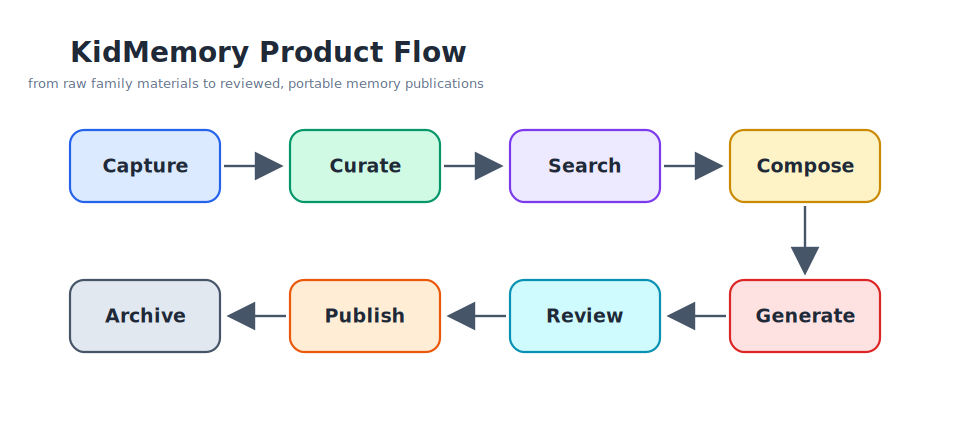
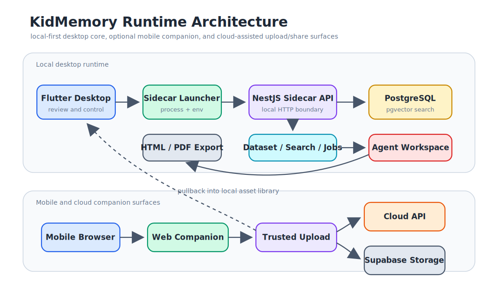

# KidMemory

<p align="center">
  <a href="README.md">中文</a> ·
  <a href="README_EN.md">English</a> ·
  <a href="https://kidmemory.baby/">Official Website</a>
</p>

<p align="center">
  
</p>

<p align="center">
  <strong>Transform a child's growth materials into searchable, editable, exportable family collections</strong><br/>
  Local-first memory workspace for families, built for privacy and long-term ownership.
</p>

<p align="center">
  
  
  
  
  
</p>

## Product Positioning

KidMemory is a local-first AI publishing system for family memories. It is built for the real flow of family materials: children's drawings, photos, crafts, notes, voice transcripts, and everyday fragments. It helps parents move from collection and curation to search, composition, generation, review, and export.

It is not just another photo album, and it is not a template wrapper. The product goal is to turn scattered growth materials into long-lived family memory assets that are searchable, editable, printable, shareable, and easy to revisit.

### Product Flow



- **Capture**: Import local files from the desktop app, or upload photos from a phone by scanning a QR code.
- **Curate**: Maintain child profiles, asset metadata, tags, timelines, and selected collections.
- **Search**: Use PostgreSQL + pgvector for semantic retrieval and asset discovery.
- **Compose**: Build book context from a topic, child profile, time range, and selected assets.
- **Generate**: Run an AI Agent in an isolated workspace to produce structured `book.json` and HTML.
- **Review**: Preview, inspect, and adjust generated content in the desktop app.
- **Publish**: Export PDF, HTML, and future printable or long-image formats.
- **Archive**: Keep local data, generated artifacts, exports, and protocol-shaped records portable.

### Complete Workflow


The desktop app covers setup, child profiles, asset import, asset library management, search, generation, and preview. The mobile companion covers desktop pairing, asset upload, lightweight browsing, and family collection viewing.

### Core Capabilities

- **Local-first desktop**: The macOS app manages the local sidecar and bundled PostgreSQL runtime by default.
- **Mobile companion**: Web Companion supports QR pairing, trusted upload, browsing, and sharing.
- **AI-assisted publishing**: AI organizes and drafts the book, while parents keep final approval.
- **Unified contracts**: sidecar, cloud-api, web, and desktop consume API contracts through `packages/protocol`.
- **Recoverable data model**: Assets, child profiles, exports, OpenAPI contracts, and generated artifacts have clear boundaries.

### Product Capabilities

- **Child profiles**: Maintain basic child information, growth stage, interests, and recent works to provide stable context for search and generation.
- **Asset library**: Import sample data, import local files, drag in assets, preview items, edit metadata, and manage or delete assets in bulk.
- **Semantic search**: Use PostgreSQL + pgvector indexes to find materials by topic, visual content, time, and child profile context.
- **Mobile upload**: Web Companion provides QR pairing, trusted upload sessions, upload status, and desktop pullback into the local library.
- **Agent configuration**: The desktop app configures AI service settings, models, workspace paths, and export paths; sidecar owns readiness checks and persistence.
- **Agent generation**: sidecar turns child profiles, selected assets, template rules, and user intent into controlled inputs, runs the Agent in an isolated workspace, and produces structured `book.json` plus previewable HTML.
- **Generation validation**: Agent outputs pass schema and business-rule checks before preview, export, and publishing.
- **Export and publishing**: Support book preview, HTML/PDF export, and export directory management, with room for long images, print books, and more sharing formats.
- **Security boundaries**: The Agent workspace cannot directly access databases, secrets, or object storage; upload signatures and cloud service role keys stay in trusted backend processes.

### Desktop Agent Capabilities

- **Built-in Skills**: sidecar provides generation skills and rule context for asset interpretation, story composition, page planning, style constraints, and export validation.
- **Built-in MCP tools**: sidecar exposes controlled MCP tools to the Agent, including asset access, context retrieval, media processing, image generation/rendering, export utilities, and diagnostics.
- **Controlled workspace**: Each generation job gets an isolated workspace with `input/`, rules, asset references, and template context. The Agent reads and writes only inside that workspace.
- **Structured artifacts**: The Agent must produce agreed files such as `book.json` and `book.html`; sidecar owns schema validation, preview conversion, and PDF export.
- **Permission isolation**: The Agent cannot directly access the database, `.env`, Supabase service role keys, or arbitrary local files. It reads controlled data through sidecar APIs and MCP tools.
- **Desktop observability**: Flutter shows Agent configuration status, generation progress, preview output, export results, and failure details so parents can review before publishing.

## Local Development Quick Start

### Requirements

- macOS, Apple Silicon recommended.
- Node.js 22 or later.
- Flutter stable with macOS desktop enabled.
- npm, Homebrew optional.

The desktop development path does not require manually starting a system PostgreSQL service. The Flutter app launches the sidecar, and the sidecar uses the PostgreSQL + pgvector runtime managed by the desktop app. You only need your own PostgreSQL when debugging sidecar or cloud-api independently.

### 1. Local Desktop Configuration

```bash
git clone https://github.com/xingbofeng/kidmemory.git
cd kidmemory
```

The desktop client does not require a `.env` file for normal local use. It starts the sidecar, manages the local PostgreSQL + pgvector runtime, and stores model and Storage setup values in the local database from the Settings page.

Create `.env` only when debugging sidecar independently, pinning ports/directories, or developing Web Companion direct upload. Common optional settings:

```env
KIDMEMORY_WORKSPACE_DIR=.kidmemory/workspace
KIDMEMORY_EXPORT_DIR=.kidmemory/exports
KIDMEMORY_DATA_DIR=.kidmemory/data
KIDMEMORY_SIDECAR_HOST=127.0.0.1
KIDMEMORY_SIDECAR_PORT=4317

WEB_COMPANION_BASE_URL=http://localhost:3001
```

Notes:

- `POSTGRES_*` variables are mainly for standalone sidecar debugging.
- During normal desktop startup, the database connection is injected dynamically and does not depend on a fixed `5432` port.
- Model and Storage setup values are entered in the desktop Settings page and are no longer loaded from `.env`.
- Web Companion trusted direct-upload values are separate development settings; they are not needed for the desktop core flow.

### 2. Install Dependencies

```bash
cd packages/protocol && npm install
cd ../sidecar && npm install
cd ../cloud-api && npm install
cd ../web && npm install
cd ../desktop && flutter pub get
```

### 3. Start the Desktop Flow

Build the sidecar output first, then run the Flutter desktop app:

```bash
cd packages/sidecar
npm run build:prod

cd ../desktop
flutter run -d macos
```

On startup, the desktop app will:

- Find `Resources/sidecar` in the app bundle, or use `KIDMEMORY_SIDECAR_DIR` when provided.
- Find the bundled PostgreSQL runtime, or use `KIDMEMORY_POSTGRES_RUNTIME_DIR` when provided.
- Allocate a local database port and inject it into the sidecar process.
- Stop the current database process when the app exits.

If your development build does not have bundled resources, set explicit paths:

```bash
export KIDMEMORY_SIDECAR_DIR="$PWD/packages/sidecar"
export KIDMEMORY_POSTGRES_RUNTIME_DIR="/path/to/postgres-runtime"
cd packages/desktop && flutter run -d macos
```

### 4. Start Web Companion

The mobile upload and sharing UI lives in `packages/web`:

```bash
cd packages/web
npm run dev
```

Vite usually serves it at `http://localhost:5173`. If the sidecar needs to generate QR codes or redirect links to a fixed public URL, update `WEB_COMPANION_BASE_URL` in `.env`.

### 5. Debug Sidecar Independently

When you only need to debug HTTP APIs, migrations, or backend tests, start PostgreSQL + pgvector yourself:

```bash
docker run -d --name postgres-dev \
  -e POSTGRES_PASSWORD=postgres \
  -p 5432:5432 \
  pgvector/pgvector:pg16

cd packages/sidecar
npm run prisma:generate
npm run prisma:migrate
npm run dev
```

Matching `.env`:

```env
POSTGRES_HOST=localhost
POSTGRES_PORT=5432
POSTGRES_DATABASE=kidmemory
POSTGRES_USER=postgres
POSTGRES_PASSWORD=postgres
```

Clean up afterwards:

```bash
docker stop postgres-dev && docker rm postgres-dev
```

### 6. Debug cloud-api Independently

`cloud-api` is the remote entry point for upload, sharing, and device sync. It usually needs its own PostgreSQL, Supabase Storage, and public deployment environment:

```bash
cd packages/cloud-api
cp .env.example .env
npm install
npm run prisma:generate
npm run prisma:migrate
npm run dev
```

You can skip cloud-api when developing only the desktop and sidecar flow.

## Project Architecture

```text
kidmemory/
├── packages/
│   ├── desktop/      Flutter macOS desktop app
│   ├── sidecar/      Local NestJS API, database, Agent orchestration, export
│   ├── cloud-api/    Cloud upload, sharing, and device sync API
│   ├── web/          Mobile Web Companion
│   └── protocol/     OpenAPI, TypeScript/Dart types, and contract entry points
├── docs/             Product, design, and architecture docs
├── packages/sidecar/examples/sample-dataset/
│                    Sample child profile, assets, and expected output
└── scripts/          Environment, test, security, and release scripts
```

### Runtime Relationships



### Package Responsibilities

- `packages/desktop`: Flutter macOS app. Entry point is `lib/main.dart`; the main shell is `lib/app/desktop_shell.dart`; sidecar access lives in `lib/core/sidecar/`.
- `packages/sidecar`: Local NestJS service. Owns readiness checks, child and asset datasets, Web Companion sessions, sync, storage, media generation, Agent config, book jobs, and PDF export.
- `packages/cloud-api`: Cloud NestJS service for remote upload, sharing, and device sync.
- `packages/web`: React/Vite mobile UI for QR upload, lightweight browsing, sharing, and trusted upload sessions.
- `packages/protocol`: Unified contract layer. OpenAPI generates TypeScript and Dart types; downstream packages should not import internal `generated/*/ts` paths directly.

### Sidecar Layers

- `src/modules/config`: readiness for environment, paths, OpenAI, PostgreSQL, and pgvector.
- `src/modules/dataset`: child profiles, asset import, asset CRUD, and sample data.
- `src/modules/books`: book jobs, previews, exports, and Agent runner.
- `src/modules/web-companion`: mobile pairing, upload sessions, trusted upload, and pullback.
- `src/modules/storage` / `sync`: object storage settings and sync jobs.
- `src/infrastructure/database`: Prisma, migrations, and pgvector support.
- `src/infrastructure/dataset-state`: switching between in-memory state and database-backed persistence.

### Desktop Layers

- `lib/app`: desktop shell, page routing, setup flow, and sidecar lifecycle.
- `lib/features`: setup, sample dataset, child profile, asset library, generate/export, and web companion pages.
- `lib/core/sidecar`: HTTP client, launcher, and desktop gateway.
- `lib/shared`: shared models and UI components.

## API and Protocol Development

API contracts live in `packages/protocol`. The `web`, `sidecar`, `cloud-api`, and `desktop` packages should consume types from protocol entry points.

1. Change the server contract in `packages/sidecar` or `packages/cloud-api`: controller, DTO, schema, or response shape.
2. Generate OpenAPI:
   ```bash
   cd packages/sidecar && npm run gen:openapi
   cd ../cloud-api && npm run gen:openapi
   ```
3. Generate protocol artifacts:
   ```bash
   cd packages/protocol
   npm run gen:ts
   npm run gen:dart
   npm run check
   ```
4. Consume public protocol entries downstream:
   - Web / Node: `@kidmemory/protocol/sidecar`, `@kidmemory/protocol/cloud-api`
   - Flutter: `package:kidmemory_protocol/kidmemory_protocol.dart`

## Common Commands

```bash
# sidecar
cd packages/sidecar && npm run dev
cd packages/sidecar && npm run build
cd packages/sidecar && npm run build:prod
cd packages/sidecar && npm test
cd packages/sidecar && npm run test:unit
cd packages/sidecar && npx tsx --test tests/architecture/architecture.test.ts

# desktop
cd packages/desktop && flutter analyze
cd packages/desktop && flutter test
cd packages/desktop && flutter test test/sidecar_api_test.dart
cd packages/desktop && flutter run -d macos

# web
cd packages/web && npm run dev
cd packages/web && npm run build
cd packages/web && npm test -- --run

# cloud-api
cd packages/cloud-api && npm run dev
cd packages/cloud-api && npm run build
cd packages/cloud-api && npm test

# protocol
cd packages/protocol && npm run check
cd packages/protocol && npm run gen:ts
cd packages/protocol && npm run gen:dart
```

Repository-level scripts:

```bash
node scripts/verify-environment.mjs
bash scripts/run-all-tests.sh
bash scripts/security-check.sh
bash scripts/pre-release-check.sh
```

## Commit Convention

The project follows Conventional Commits:

```text
feat(desktop): support bulk delete for selected assets
fix(sidecar): handle trusted upload timeout
docs(readme): clarify local development startup
```

## License

This project is licensed under the [MIT License](LICENSE).

## Links

- [Official Website](https://kidmemory.baby/)
- [GitHub Repository](https://github.com/xingbofeng/kidmemory)
- [GitHub Issues](https://github.com/xingbofeng/kidmemory/issues)
- [GitHub Discussions](https://github.com/xingbofeng/kidmemory/discussions)

---

<p align="center">
  <strong>Empowering family memories with AI and long-term ownership</strong><br/>
  Made with love for families who cherish memories
</p>
