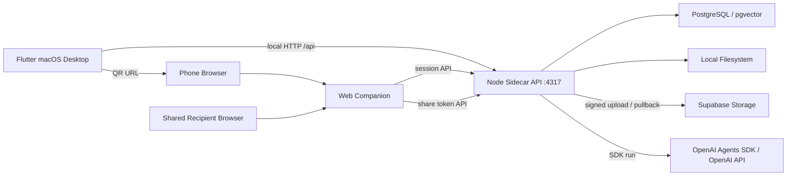
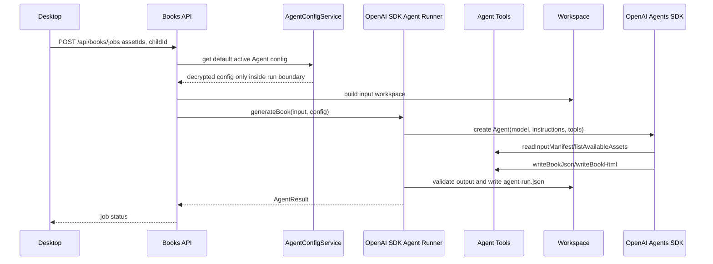
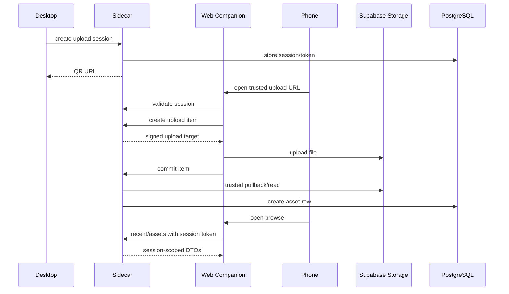
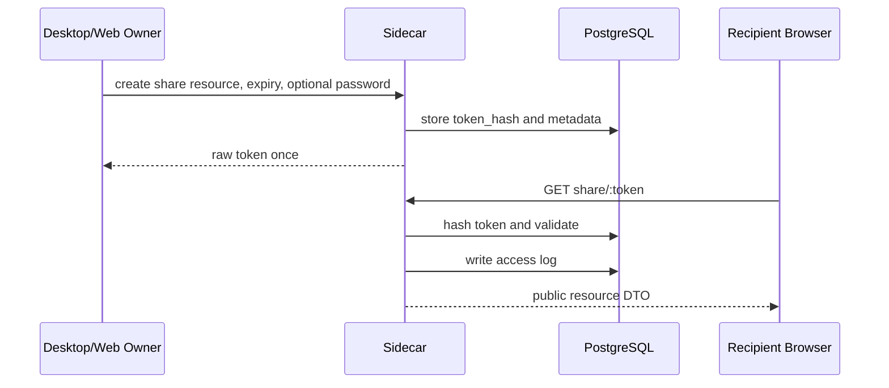

# KidMemory 0.5-1.0 Completion Plan Revised

> **For agentic workers:** REQUIRED SUB-SKILL: Use superpowers:subagent-driven-development or superpowers:executing-plans to implement this plan task-by-task. Steps use checkbox (`- [ ]`) syntax for tracking.

**Goal:** Bring KidMemory from the current 0.8-era MVP state to a releaseable 1.0 open-source desktop product.

**Architecture:** Keep the local-first desktop app as the primary product surface, keep the Node sidecar as the single API and orchestration boundary, and treat the web companion as a session-scoped mobile client. Do not add parallel implementations when an existing prototype can be hardened.

**Tech Stack:** Flutter macOS desktop, Node 22+ sidecar, PostgreSQL/pgvector, Vite/React web companion, Supabase Storage for the 0.8 trusted upload path, Node test runner, Flutter test/analyze.

---

## Current State Correction

The previous draft had the right strategic direction, but several implementation assumptions were too loose. This revision reflects the repository state as of 2026-05-15.

### Production-ready or mostly ready

- 0.8 Web Companion trusted backend upload has a working core path and backend test coverage.
- 0.7 Direct Upload remains in the codebase as a fallback/prototype path.
- Desktop asset management, search, generation, export, and 0.8 trusted upload entry points exist.
- Agent runners exist in both legacy and unified forms.
- A database migration service exists, but currently only loads `packages/backend/sql/001_final_schema.sql`.

### Existing prototypes that must be productized

- The web companion already has browse/books UI prototypes in `packages/web/src/App.tsx`.
- The web companion already has `AssetBrowser` and tests.
- Desktop already has an `agent_settings_page.dart`, but it needs real persistence and API integration.

### Missing or incomplete for 1.0

- Versioning policy is inconsistent across package manifests.
- 0.6 browse/share backend contracts are incomplete.
- Share links need a security model, persistence, and tests.
- Agent configuration needs a secure persisted backend API and compatibility migration.
- Migration loading, backup/restore, install packaging, and release automation need to be finished.

---

## Release Strategy

### Version policy

Use the product version as the user-facing release line and keep package versions explicit:

- Product/docs version for this milestone: `1.0.0`.
- 0.8 remains a historical feature milestone, not the final package version.
- Package manifests should be aligned during the release-prep phase:
  - `packages/desktop/pubspec.yaml`: `version: 1.0.0+1`
  - `packages/backend/package.json`: `"version": "1.0.0"`
  - `packages/web/package.json`: `"version": "1.0.0"`
- README badges and release docs should describe the current product as `1.0.0`, while preserving links to historical 0.5-0.9 docs.

### Branch and commit policy

- Use branch prefix `codex/`.
- Commit every completed phase or isolated feature slice.
- Use Conventional Commits and include:

```text
Co-authored-by: OpenAI Codex <codex@openai.com>
```

### Required validation commands

Run the relevant subset after each task, and all commands before final 1.0 release:

```bash
cd packages/backend && npm test
cd packages/backend && npm run build
cd packages/web && npm test -- --run
cd packages/web && npm run build
cd packages/desktop && flutter analyze
cd packages/desktop && flutter test
```

Expected final result: all commands pass on a clean checkout with documented environment prerequisites.

---

## File Responsibility Map

### Backend

- `packages/backend/src/modules/web-companion/web-companion.controller.ts`  
  Owns HTTP route registration for upload, browse, and share endpoints.

- `packages/backend/src/modules/web-companion/web-companion.service.ts`  
  Owns existing trusted upload session and item workflow. Keep upload behavior stable.

- `packages/backend/src/modules/web-companion/browse.service.ts`  
  New service for session-scoped browse queries.

- `packages/backend/src/modules/web-companion/share.service.ts`  
  New service for creating, validating, revoking, and auditing share tokens.

- `packages/backend/src/modules/security/encryption.service.ts`  
  New shared encryption helper for API keys and backup encryption metadata.

- `packages/backend/src/modules/security/rate-limiter.service.ts`  
  New lightweight in-process limiter for local sidecar HTTP endpoints.

- `packages/backend/src/modules/config/agent-config.service.ts`  
  New persisted agent configuration service.

- `packages/backend/src/modules/books/providers/unified-agent-runner.interface.ts`  
  Keep as the canonical runner interface.

- `packages/backend/src/modules/books/providers/openai-sdk-agent-runner.ts`  
  New canonical full Agent runner implemented with the OpenAI Agents SDK for TypeScript. It owns Agent construction, tools, run orchestration, output validation, trace capture, and workspace file writes.

- `packages/backend/src/modules/books/providers/agent-tools.ts`  
  New tool definitions exposed to the SDK Agent for reading workspace input, selecting assets, writing `book.json`, writing `book.html`, and validating output.

- `packages/backend/src/modules/books/providers/agent-output-schema.ts`  
  New structured output schema for the generated KidMemory book.

- `packages/backend/src/modules/books/providers/unified-openai-agent-runner.ts`  
  Keep only as a compatibility wrapper while migrating callers to `openai-sdk-agent-runner.ts`.

- `packages/backend/src/infrastructure/database/migration.service.ts`  
  Extend existing service to load ordered migration files from `packages/backend/sql/migrations/`.

- `packages/backend/sql/001_final_schema.sql`  
  Keep as the bootstrap schema for fresh installs until replaced by a deliberate schema strategy.

- `packages/backend/sql/migrations/*.sql`  
  New ordered migrations after the loader supports this directory.

### Web companion

- `packages/web/src/App.tsx`  
  Keep the current path switch for `/direct-upload` and `/trusted-upload`; add route-level handling for `/browse` and `/share/:token` without duplicating existing tab prototypes.

- `packages/web/src/components/AssetBrowser.tsx`  
  Reuse and harden for real browse responses.

- `packages/web/src/components/BrowsePage.tsx`  
  New route-level wrapper around existing browse components.

- `packages/web/src/components/SharePage.tsx`  
  New public token-gated shared resource view.

### Desktop

- `packages/desktop/lib/features/agent_settings/agent_settings_page.dart`  
  Convert from local/mock UI to real sidecar-backed settings.

- `packages/desktop/lib/app/app_step.dart`  
  Add `agentSettings` and `backup` only when matching pages are integrated.

- `packages/desktop/lib/shared/widgets/chrome.dart`  
  Add navigation entries and status indicators.

- `packages/desktop/lib/features/backup/backup_page.dart`  
  New backup/restore UI.

### Release and docs

- `README.md`
- `README_EN.md`
- `docs/milestones/trusted-upload/release-report.md`
- `docs/milestones/stable-release/release-readiness.md`
- `docs/installation/fresh-setup-guide.md`
- `.github/workflows/release.yml`
- `scripts/build-macos-app.sh`
- `scripts/create-installer.sh`
- `scripts/setup-dependencies.sh`

---

## Phase 0: Baseline Audit And Guardrails

**Duration:** 2-3 days  
**Purpose:** Prevent duplicate implementation and lock the ground truth before feature work starts.

**Files:**

- Modify: `docs/milestones/stable-release/release-readiness.md`
- Modify: `docs/superpowers/specs/2026-05-15-kidmemory-completion-plan-revised.md`

- [ ] **Step 0.1: Record package version policy**

Create or update `docs/milestones/stable-release/release-readiness.md` with:

```markdown
# KidMemory 1.0 Release Readiness

## Version Policy

- Product version: 1.0.0
- Desktop package version: 1.0.0+1
- Backend package version: 1.0.0
- Web companion package version: 1.0.0
- Historical version docs under docs/milestones/0.x remain as milestone records.
```

- [ ] **Step 0.2: Inventory existing feature entry points**

Run:

```bash
rg -n "direct-upload|trusted-upload|browse|books|AgentSettings|agentSettings|DatabaseMigrationService" packages docs
```

Expected: output includes the current Direct Upload, Trusted Upload, web browse/books prototypes, desktop agent settings page, and migration service.

- [ ] **Step 0.3: Commit baseline docs**

```bash
git add docs/milestones/stable-release/release-readiness.md docs/superpowers/specs/2026-05-15-kidmemory-completion-plan-revised.md
git commit -m "docs(release): clarify 1.0 completion plan baseline"
```

---

## Phase 1: 0.8 Release Closure

**Duration:** 1-2 weeks  
**Purpose:** Close the current trusted upload milestone without breaking the fallback Direct Upload path.

### Task 1.1: Version And Documentation Alignment

**Files:**

- Modify: `README.md`
- Modify: `README_EN.md`
- Modify: `docs/milestones/trusted-upload/release-report.md`
- Modify: `docs/milestones/stable-release/release-readiness.md`
- Modify: `packages/desktop/pubspec.yaml`
- Modify: `packages/backend/package.json`
- Modify: `packages/web/package.json`

- [ ] **Step 1.1.1: Update manifest versions for release line**

Set:

```text
packages/desktop/pubspec.yaml -> version: 1.0.0+1
packages/backend/package.json -> "version": "1.0.0"
packages/web/package.json -> "version": "1.0.0"
```

- [ ] **Step 1.1.2: Update README version language**

README files must explain:

- 0.8 trusted upload is implemented.
- Direct Upload is retained only as a fallback/prototype.
- Stable release work contains install, backup, migration, and stable docs.

- [ ] **Step 1.1.3: Validate docs build assumptions**

Run:

```bash
rg -n "Version-|release label|stale package metadata" README.md README_EN.md packages
```

Expected: no stale release labels remain except required package metadata.

- [ ] **Step 1.1.4: Commit**

```bash
git add README.md README_EN.md docs/milestones/trusted-upload/release-report.md docs/milestones/stable-release/release-readiness.md packages/desktop/pubspec.yaml packages/backend/package.json packages/web/package.json
git commit -m "docs(release): align KidMemory 1.0 version metadata"
```

### Task 1.2: Direct Upload Retention Decision

**Files:**

- Modify: `docs/milestones/trusted-upload/release-report.md`
- Modify only if needed: `packages/web/src/App.tsx`
- Modify only if needed: `packages/desktop/lib/features/asset_library/asset_library_widgets.dart`
- Modify only if needed: `packages/desktop/lib/features/web_companion/direct_upload/*`

- [ ] **Step 1.2.1: Mark Direct Upload as fallback**

Do not delete Direct Upload yet. Document that:

- `/direct-upload` remains available for manual fallback testing.
- It is not the default user path.
- Trusted Upload is the default supported flow.

- [ ] **Step 1.2.2: Verify default desktop entry points**

Run:

```bash
rg -n "扫码上传|DirectUploadEntryButton|TrustedUpload" packages/desktop/lib
```

Expected: the user-facing primary upload entry is the trusted upload flow.

- [ ] **Step 1.2.3: Run regression tests**

```bash
cd packages/backend && npm test
cd packages/web && npm test -- --run
cd packages/desktop && flutter test
```

Expected: tests pass.

- [ ] **Step 1.2.4: Commit**

```bash
git add docs/milestones/trusted-upload/release-report.md packages/web/src/App.tsx packages/desktop/lib/features/asset_library packages/desktop/lib/features/web_companion
git commit -m "docs(web-companion): mark direct upload as fallback"
```

---

## Phase 2: Web Companion Browse And Share

**Duration:** 3-4 weeks  
**Purpose:** Productize existing mobile browse/books UI and add secure share links.

### Task 2.1: Backend Browse Contract

**Files:**

- Create: `packages/backend/src/modules/web-companion/browse.service.ts`
- Modify: `packages/backend/src/modules/web-companion/web-companion.controller.ts`
- Test: `packages/backend/tests/unit/web-companion/browse-service.test.ts`
- Test: `packages/backend/tests/unit/web-companion/browse-controller.test.ts`

- [ ] **Step 2.1.1: Write tests first**

Test cases:

- Valid session token can list recent uploads.
- Invalid session token receives 401/403.
- Asset details only return assets owned by the session child.
- Book list is filtered by child/session context.

- [ ] **Step 2.1.2: Implement `BrowseService`**

Required methods:

```typescript
getRecentUploads(input: { sessionId: string; token: string; limit?: number }): Promise<RecentUploadDto[]>
getAssetDetails(input: { sessionId: string; token: string; assetId: string }): Promise<AssetDetailDto>
getBooksList(input: { sessionId: string; token: string; childId?: string }): Promise<BookSummaryDto[]>
getBookDetails(input: { sessionId: string; token: string; bookId: string }): Promise<BookDetailDto>
```

- [ ] **Step 2.1.3: Add controller endpoints**

Add:

```text
GET /api/web-companion/sessions/:sessionId/recent
GET /api/web-companion/sessions/:sessionId/assets/:assetId
GET /api/web-companion/sessions/:sessionId/books
GET /api/web-companion/sessions/:sessionId/books/:bookId
```

Each endpoint must require the same session token validation model as trusted upload.

- [ ] **Step 2.1.4: Run backend tests**

```bash
cd packages/backend && npm test
```

Expected: browse tests and existing web companion tests pass.

- [ ] **Step 2.1.5: Commit**

```bash
git add packages/backend/src/modules/web-companion packages/backend/tests/unit/web-companion
git commit -m "feat(web-companion): add session-scoped browse API"
```

### Task 2.2: Share Token Model And Security

**Files:**

- Create: `packages/backend/sql/migrations/002_share_tokens.sql`
- Create: `packages/backend/src/modules/web-companion/share.service.ts`
- Create: `packages/backend/src/modules/security/rate-limiter.service.ts`
- Modify: `packages/backend/src/modules/web-companion/web-companion.controller.ts`
- Test: `packages/backend/tests/unit/web-companion/share-service.test.ts`
- Test: `packages/backend/tests/unit/web-companion/share-controller.test.ts`

- [ ] **Step 2.2.1: Define share token schema**

Use a normalized access log table. Do not duplicate access logs in `share_tokens`.

```sql
CREATE TABLE IF NOT EXISTS share_tokens (
  id text PRIMARY KEY,
  resource_type text NOT NULL CHECK (resource_type IN ('asset', 'book')),
  resource_id text NOT NULL,
  token_hash text NOT NULL UNIQUE,
  password_hash text,
  expires_at timestamptz NOT NULL,
  max_access_count integer,
  current_access_count integer NOT NULL DEFAULT 0,
  revoked_at timestamptz,
  created_by text NOT NULL,
  created_at timestamptz NOT NULL DEFAULT now()
);

CREATE TABLE IF NOT EXISTS share_access_logs (
  id text PRIMARY KEY,
  token_id text NOT NULL REFERENCES share_tokens(id) ON DELETE CASCADE,
  ip_address inet,
  user_agent text,
  accessed_at timestamptz NOT NULL DEFAULT now(),
  access_result text NOT NULL CHECK (access_result IN ('success', 'denied', 'expired', 'revoked', 'rate_limited'))
);
```

Security requirements:

- Generate at least 32 random bytes per token.
- Store only token hashes.
- Default expiry: 7 days.
- Maximum expiry: 30 days.
- Optional password must be hashed with Node `crypto.scrypt`.
- Rate-limit validation attempts by token hash and client address.
- Never log raw tokens or passwords.

- [ ] **Step 2.2.2: Implement `ShareService`**

Required methods:

```typescript
createShareToken(input: CreateShareTokenInput): Promise<CreateShareTokenResult>
validateShareToken(input: ValidateShareTokenInput): Promise<ValidatedShare>
getSharedResource(input: GetSharedResourceInput): Promise<SharedResourceDto>
revokeShareToken(input: RevokeShareTokenInput): Promise<void>
getShareAccessLogs(input: GetShareAccessLogsInput): Promise<ShareAccessLogDto[]>
```

- [ ] **Step 2.2.3: Add share endpoints**

Add:

```text
POST /api/web-companion/share
GET /api/web-companion/share/:token
DELETE /api/web-companion/share/:token
```

- [ ] **Step 2.2.4: Run backend tests and build**

```bash
cd packages/backend && npm test
cd packages/backend && npm run build
```

Expected: all tests and lint/build checks pass.

- [ ] **Step 2.2.5: Commit**

```bash
git add packages/backend/sql packages/backend/src/modules/web-companion packages/backend/src/modules/security packages/backend/tests/unit/web-companion
git commit -m "feat(web-companion): add secure share tokens"
```

### Task 2.3: Web Browse And Share UI

**Files:**

- Modify: `packages/web/src/App.tsx`
- Modify: `packages/web/src/components/AssetBrowser.tsx`
- Create: `packages/web/src/components/BrowsePage.tsx`
- Create: `packages/web/src/components/SharePage.tsx`
- Test: `packages/web/src/components/BrowsePage.test.tsx`
- Test: `packages/web/src/components/SharePage.test.tsx`
- Modify: `packages/web/src/test/mocks/handlers.ts`

- [ ] **Step 2.3.1: Preserve existing prototypes**

Do not remove the existing `browse` and `books` tabs until the new route-level pages cover the same interactions.

- [ ] **Step 2.3.2: Add route-level `/browse` handling**

`/browse` must read:

```text
sessionId
token
```

If either is missing, show a blocking error with a return-to-upload action.

- [ ] **Step 2.3.3: Add `/share/:token` handling**

Render a read-only shared resource page. Do not expose asset IDs, internal paths, local filesystem paths, or raw token values in visible UI.

- [ ] **Step 2.3.4: Run web tests and build**

```bash
cd packages/web && npm test -- --run
cd packages/web && npm run build
```

Expected: tests and Vite build pass.

- [ ] **Step 2.3.5: Commit**

```bash
git add packages/web/src
git commit -m "feat(web): productize companion browse and share pages"
```

---

## Phase 3: Full SDK Agent Configuration And Runner

**Duration:** 2-3 weeks  
**Purpose:** Make KidMemory generation use a complete SDK-based Agent, with persisted user configuration, tools, structured output, traceable runs, and safe compatibility with existing legacy runners.

This phase must not reduce Agent to a thin HTTP call such as `POST /v1/agents/generate`. The sidecar should instantiate and run the Agent through the SDK. Local `8080` services are allowed only as optional model/provider debugging endpoints when the chosen SDK/provider supports a custom base URL; they are not the product architecture.

### Task 3.1: Agent Config Persistence

**Files:**

- Create: `packages/backend/sql/migrations/003_agent_configs.sql`
- Create: `packages/backend/src/modules/security/encryption.service.ts`
- Create: `packages/backend/src/modules/config/agent-config.service.ts`
- Modify: `packages/backend/src/modules/config/config.controller.ts`
- Modify: `packages/backend/package.json`
- Test: `packages/backend/tests/unit/agent-config-service.test.ts`
- Test: `packages/backend/tests/http/agent-config-controller.test.ts`

- [ ] **Step 3.1.1: Define config schema**

```sql
CREATE TABLE IF NOT EXISTS agent_configs (
  id text PRIMARY KEY,
  name text NOT NULL UNIQUE,
  provider text NOT NULL CHECK (provider IN ('openai')),
  base_url text,
  api_key_encrypted text NOT NULL,
  model text NOT NULL,
  agent_name text NOT NULL DEFAULT 'KidMemory Book Agent',
  instructions text,
  enable_tracing boolean NOT NULL DEFAULT true,
  is_default boolean NOT NULL DEFAULT false,
  status text NOT NULL DEFAULT 'inactive' CHECK (status IN ('active', 'inactive', 'error')),
  last_tested_at timestamptz,
  test_result jsonb,
  created_at timestamptz NOT NULL DEFAULT now(),
  updated_at timestamptz NOT NULL DEFAULT now()
);

CREATE UNIQUE INDEX IF NOT EXISTS one_default_agent_config
  ON agent_configs (is_default)
  WHERE is_default = true;

CREATE TABLE IF NOT EXISTS agent_config_audit (
  id text PRIMARY KEY,
  config_id text REFERENCES agent_configs(id) ON DELETE SET NULL,
  action text NOT NULL CHECK (action IN ('create', 'update', 'delete', 'test', 'use', 'set_default')),
  changed_fields jsonb,
  created_at timestamptz NOT NULL DEFAULT now()
);
```

- [ ] **Step 3.1.2: Implement encryption**

Use Node `crypto` AES-256-GCM. Store IV, auth tag, and ciphertext in a structured string. The encryption key must come from local configuration and fail closed if missing in production mode.

- [ ] **Step 3.1.3: Add SDK dependency**

Add the OpenAI Agents SDK TypeScript package to `packages/backend/package.json`.

Expected dependency:

```json
{
  "dependencies": {
    "@openai/agents": "latest"
  }
}
```

When pinning is required for reproducible release builds, replace `latest` with the current tested version and record it in `docs/milestones/stable-release/release-readiness.md`.

- [ ] **Step 3.1.4: Implement config API**

Endpoints:

```text
GET /api/config/agent-configs
POST /api/config/agent-configs
PATCH /api/config/agent-configs/:id
DELETE /api/config/agent-configs/:id
POST /api/config/agent-configs/:id/test
POST /api/config/agent-configs/:id/default
```

Never return decrypted API keys.

- [ ] **Step 3.1.5: Run backend validation**

```bash
cd packages/backend && npm test
cd packages/backend && npm run build
```

- [ ] **Step 3.1.6: Commit**

```bash
git add packages/backend/package.json packages/backend/package-lock.json packages/backend/sql packages/backend/src/modules/security packages/backend/src/modules/config packages/backend/tests
git commit -m "feat(agent): persist encrypted agent configurations"
```

### Task 3.2: Full OpenAI Agents SDK Runner

**Files:**

- Modify: `packages/backend/src/modules/books/providers/unified-agent-runner.interface.ts`
- Create: `packages/backend/src/modules/books/providers/openai-sdk-agent-runner.ts`
- Create: `packages/backend/src/modules/books/providers/agent-tools.ts`
- Create: `packages/backend/src/modules/books/providers/agent-output-schema.ts`
- Modify: `packages/backend/src/modules/books/providers/unified-openai-agent-runner.ts`
- Modify: `packages/backend/src/modules/books/providers/agent-runner-manager.ts`
- Test: `packages/backend/tests/unit/agent.test.ts`
- Test: `packages/backend/tests/unit/openai-sdk-agent-runner.test.ts`
- Test: `packages/backend/tests/unit/publication-flow.test.ts`

- [ ] **Step 3.2.1: Keep legacy runners during migration**

Do not delete:

```text
agent-runner.interface.ts
agent-runner-manager.ts
claude-agent-runner.ts
openai-agent-runner.ts
local-agent-runner.ts
```

until the unified runner is default, tested, and documented.

- [ ] **Step 3.2.2: Define the full Agent contract**

The SDK runner must build a real Agent with:

- Agent name from config, defaulting to `KidMemory Book Agent`.
- Instructions that describe KidMemory's book-generation task.
- Model from persisted user config.
- Tools for controlled workspace access.
- Structured final output matching `agent-output-schema.ts`.
- Trace capture when `enable_tracing` is true.

The runner must produce these files in the workspace:

```text
output/book.json
output/book.html
output/agent-run.json
```

`output/agent-run.json` must include:

```json
{
  "provider": "openai",
  "model": "configured model",
  "agentName": "KidMemory Book Agent",
  "startedAt": "ISO-8601 timestamp",
  "finishedAt": "ISO-8601 timestamp",
  "status": "success",
  "traceId": "SDK trace id when available"
}
```

- [ ] **Step 3.2.3: Implement SDK tools**

`agent-tools.ts` must expose only safe workspace operations:

- `readInputManifest`: read `input/assets.json`.
- `readGenerationRules`: read `rules/generation.md`.
- `listAvailableAssets`: return asset IDs, titles, types, and relative paths.
- `writeBookJson`: write validated `output/book.json`.
- `writeBookHtml`: write sanitized `output/book.html`.
- `validateBookOutput`: check that every referenced asset ID exists and required pages are present.

Do not expose arbitrary filesystem read/write tools to the Agent.

- [ ] **Step 3.2.4: Implement SDK runner**

`openai-sdk-agent-runner.ts` must:

- Decrypt the persisted API key only inside the run/test path.
- Set SDK client configuration from user config.
- Support official OpenAI API by default.
- Support custom `base_url` only as a debugging/provider option, not as a required local HTTP Agent server.
- Run the Agent through the SDK.
- Validate structured output before writing final artifacts.
- Return `AgentResult` with `runner: "openai-sdk"`.

- [ ] **Step 3.2.5: Add compatibility adapter**

The manager should select:

1. Persisted default agent config when available.
2. Existing environment/config fallback when no persisted config exists.
3. Mock/local runner for tests.

- [ ] **Step 3.2.6: Add retry and output repair**

Enhance the SDK runner with:

- Exponential backoff for transient SDK/provider/rate-limit errors.
- JSON extraction and validation before accepting model output.
- HTML sanitization for generated pages.
- Error classification: `configuration`, `auth`, `rate_limit`, `network`, `invalid_output`, `unknown`.

- [ ] **Step 3.2.7: Run agent and publication tests**

```bash
cd packages/backend && node --test tests/unit/agent.test.ts tests/unit/openai-sdk-agent-runner.test.ts tests/unit/publication-flow.test.ts
cd packages/backend && npm run build
```

- [ ] **Step 3.2.8: Commit**

```bash
git add packages/backend/src/modules/books/providers packages/backend/tests/unit/agent.test.ts packages/backend/tests/unit/openai-sdk-agent-runner.test.ts packages/backend/tests/unit/publication-flow.test.ts
git commit -m "feat(agent): generate books with OpenAI Agents SDK"
```

### Task 3.3: Desktop Agent Settings Integration

**Files:**

- Modify: `packages/desktop/lib/features/agent_settings/agent_settings_page.dart`
- Modify: `packages/desktop/lib/app/app_step.dart`
- Modify: `packages/desktop/lib/app/desktop_shell.dart`
- Modify: `packages/desktop/lib/shared/widgets/chrome.dart`
- Test: `packages/desktop/test/agent_settings_page_test.dart`

- [ ] **Step 3.3.1: Add sidecar-backed settings UI**

The page must support:

- List configs.
- Create config.
- Edit config metadata.
- Replace API key without displaying the previous key.
- Delete config.
- Test config.
- Set default config.
- Configure optional custom base URL for SDK/provider debugging.
- Configure Agent name, model, and tracing.

- [ ] **Step 3.3.2: Add navigation and status**

Sidebar status:

- `未配置`: no persisted config.
- `已配置`: default config active.
- `异常`: default config has status `error`.

- [ ] **Step 3.3.3: Run desktop validation**

```bash
cd packages/desktop && flutter analyze
cd packages/desktop && flutter test
```

- [ ] **Step 3.3.4: Commit**

```bash
git add packages/desktop/lib packages/desktop/test
git commit -m "feat(desktop): manage agent settings through sidecar"
```

---

## Phase 4: Migration, Backup, And Release Packaging

**Duration:** 4-5 weeks  
**Purpose:** Make fresh install and upgrade safe enough for 1.0.

### Task 4.1: Migration Loader Upgrade

**Files:**

- Modify: `packages/backend/src/infrastructure/database/migration.service.ts`
- Create: `packages/backend/sql/migrations/002_share_tokens.sql`
- Create: `packages/backend/sql/migrations/003_agent_configs.sql`
- Create: `packages/backend/sql/migrations/004_performance_indexes.sql`
- Create: `packages/backend/sql/migrations/005_security_constraints.sql`
- Test: `packages/backend/tests/unit/database-migration.test.ts`

- [ ] **Step 4.1.1: Extend migration loading before adding more migrations**

`DatabaseMigrationService.loadAvailableMigrations()` must load:

1. `packages/backend/sql/001_final_schema.sql`
2. Every `*.sql` file in `packages/backend/sql/migrations/`, sorted lexicographically

Expected names:

```text
001_final_schema.sql
002_share_tokens.sql
003_agent_configs.sql
004_performance_indexes.sql
005_security_constraints.sql
```

- [ ] **Step 4.1.2: Add migration tests**

Test cases:

- Loads `001_final_schema.sql`.
- Loads migration directory files in order.
- Does not reapply already recorded migrations.
- Stops on the first failed migration.

- [ ] **Step 4.1.3: Run tests**

```bash
cd packages/backend && node --test tests/unit/database-migration.test.ts
cd packages/backend && npm run build
```

- [ ] **Step 4.1.4: Commit**

```bash
git add packages/backend/src/infrastructure/database packages/backend/sql packages/backend/tests/unit/database-migration.test.ts
git commit -m "feat(database): load ordered SQL migrations"
```

### Task 4.2: Backup And Restore

**Files:**

- Create: `packages/backend/src/modules/backup/backup.service.ts`
- Create: `packages/backend/src/modules/backup/backup.controller.ts`
- Create: `packages/desktop/lib/features/backup/backup_page.dart`
- Modify: `packages/desktop/lib/app/app_step.dart`
- Modify: `packages/desktop/lib/app/desktop_shell.dart`
- Modify: `packages/desktop/lib/shared/widgets/chrome.dart`
- Test: `packages/backend/tests/unit/backup-service.test.ts`
- Test: `packages/desktop/test/backup_page_test.dart`

- [ ] **Step 4.2.1: Implement backup format**

Backup archive must contain:

```text
manifest.json
database.sql
assets/
exports/
checksums.json
```

The manifest must include:

```json
{
  "product": "KidMemory",
  "version": "1.0.0",
  "createdAt": "ISO-8601 timestamp",
  "schemaVersion": "latest applied migration",
  "encrypted": true
}
```

- [ ] **Step 4.2.2: Implement restore safeguards**

Restore must:

- Validate manifest.
- Validate checksums.
- Create a pre-restore backup.
- Require explicit confirmation from the desktop UI.
- Refuse restore when backup schema is newer than the running app supports.

- [ ] **Step 4.2.3: Run validation**

```bash
cd packages/backend && node --test tests/unit/backup-service.test.ts
cd packages/backend && npm run build
cd packages/desktop && flutter analyze
cd packages/desktop && flutter test
```

- [ ] **Step 4.2.4: Commit**

```bash
git add packages/backend/src/modules/backup packages/backend/tests/unit/backup-service.test.ts packages/desktop/lib packages/desktop/test
git commit -m "feat(backup): add encrypted backup and restore workflow"
```

### Task 4.3: macOS Packaging And Install Guide

**Files:**

- Create: `scripts/build-macos-app.sh`
- Create: `scripts/create-installer.sh`
- Create: `scripts/setup-dependencies.sh`
- Create: `docs/installation/fresh-setup-guide.md`
- Create: `docs/milestones/stable-release/release-readiness.md` if not already present

- [ ] **Step 4.3.1: Document prerequisites**

`docs/installation/fresh-setup-guide.md` must include:

- macOS supported versions.
- Flutter requirement for contributors.
- Node 22+ requirement for sidecar development.
- PostgreSQL and pgvector setup.
- Supabase configuration required for trusted upload.
- First-run verification steps.

- [ ] **Step 4.3.2: Build script behavior**

`scripts/build-macos-app.sh` must:

- Run backend build.
- Run web build.
- Run Flutter macOS build.
- Produce a versioned artifact directory.
- Print artifact path.

- [ ] **Step 4.3.3: Installer script behavior**

`scripts/create-installer.sh` must:

- Verify build artifact exists.
- Package the app.
- Support unsigned local packaging.
- Support signed/notarized packaging when signing environment variables are present.

- [ ] **Step 4.3.4: Run local packaging smoke test**

```bash
bash scripts/build-macos-app.sh
bash scripts/create-installer.sh
```

Expected: a local unsigned artifact is produced when signing credentials are absent.

- [ ] **Step 4.3.5: Commit**

```bash
git add scripts docs/installation docs/milestones/stable-release
git commit -m "build(release): add macOS packaging scripts"
```

### Task 4.4: Release Workflow

**Files:**

- Create: `.github/workflows/release.yml`
- Modify: `docs/milestones/stable-release/release-readiness.md`

- [ ] **Step 4.4.1: Add CI release workflow**

Workflow must run:

```bash
cd packages/backend && npm test && npm run build
cd packages/web && npm test -- --run && npm run build
cd packages/desktop && flutter analyze && flutter test
```

Then run packaging scripts on macOS runners.

- [ ] **Step 4.4.2: Add signing gates**

When signing secrets are absent, workflow must produce an unsigned development artifact and mark notarization as skipped. When signing secrets are present, workflow must sign and notarize.

- [ ] **Step 4.4.3: Commit**

```bash
git add .github/workflows/release.yml docs/milestones/stable-release/release-readiness.md
git commit -m "ci(release): add 1.0 release workflow"
```

---

## Phase 5: Quality, Security, And Community Readiness

**Duration:** 2 weeks  
**Purpose:** Turn feature-complete into release-ready.

### Task 5.1: End-to-End And Performance Tests

**Files:**

- Create: `tests/e2e/complete-workflow.test.js`
- Create: `tests/performance/benchmark.test.js`
- Modify: `docs/milestones/stable-release/release-readiness.md`

- [ ] **Step 5.1.1: Define E2E coverage**

Cover:

- Fresh setup.
- Trusted upload from web companion.
- Browse recent uploads.
- Generate a book.
- Export.
- Create and restore backup.
- Upgrade migration smoke test.

- [ ] **Step 5.1.2: Define performance targets**

Targets:

- Import 1000 images in under 5 minutes on the reference machine.
- Browse recent uploads returns in under 1 second for 1000 assets.
- Non-Agent local UI actions respond in under 2 seconds.
- Agent generation target is measured separately because external model latency is provider-dependent.

- [ ] **Step 5.1.3: Commit**

```bash
git add tests docs/milestones/stable-release/release-readiness.md
git commit -m "test(release): add 1.0 workflow and performance coverage"
```

### Task 5.2: Security Review

**Files:**

- Create: `docs/security/1.0-security-review.md`
- Create: `SECURITY.md`
- Modify: `docs/milestones/stable-release/release-readiness.md`

- [ ] **Step 5.2.1: Run dependency checks**

```bash
cd packages/backend && npm audit
cd packages/web && npm audit
cd packages/desktop && flutter pub deps
```

Record findings and remediation decisions.

- [ ] **Step 5.2.2: Review privacy-sensitive flows**

Document:

- Share token storage and expiry.
- Access log retention.
- API key encryption.
- Backup encryption.
- Local network exposure.
- Supabase object lifecycle for trusted upload.

- [ ] **Step 5.2.3: Commit**

```bash
git add docs/security SECURITY.md docs/milestones/stable-release/release-readiness.md
git commit -m "docs(security): add 1.0 security review"
```

### Task 5.3: Community Files

**Files:**

- Create: `CONTRIBUTING.md`
- Create: `CODE_OF_CONDUCT.md`
- Create: `.github/ISSUE_TEMPLATE/bug_report.md`
- Create: `.github/ISSUE_TEMPLATE/feature_request.md`
- Create: `.github/PULL_REQUEST_TEMPLATE.md`
- Modify: `README.md`
- Modify: `README_EN.md`

- [ ] **Step 5.3.1: Add contributor docs**

Include:

- Setup commands.
- Test commands.
- Conventional commit format.
- Local-first/privacy expectations.
- Where to discuss bugs and features.

- [ ] **Step 5.3.2: Commit**

```bash
git add CONTRIBUTING.md CODE_OF_CONDUCT.md .github README.md README_EN.md
git commit -m "docs(community): prepare open source contribution docs"
```

---

## Final Release Gates

1. Backend:

```bash
cd packages/backend && npm test
cd packages/backend && npm run build
```

2. Web:

```bash
cd packages/web && npm test -- --run
cd packages/web && npm run build
```

3. Desktop:

```bash
cd packages/desktop && flutter analyze
cd packages/desktop && flutter test
```

4. Packaging:

```bash
bash scripts/build-macos-app.sh
bash scripts/create-installer.sh
```

5. Documentation:

```bash
rg -n "0\\.4\\.0\\+1|\"version\": \"0\\.3\\.0\"|\"version\": \"1\\.2\\.0\"" README.md README_EN.md docs packages
rg -n "TB[D]|TO[D]O" README.md README_EN.md docs packages
```

Expected: no release-blocking placeholders or stale current-version strings.

---

## Detailed User Stories And Acceptance Criteria

This section is the execution contract for 1.0. Implementers should treat each story as independently testable. A story is not complete until its acceptance criteria pass and the listed engineering slices are either implemented or explicitly deferred in `docs/milestones/stable-release/release-readiness.md`.

### Epic A: First Run And Local Setup

#### Story A1: First-time parent completes local setup

**As a** parent installing KidMemory on macOS  
**I want** the app to guide me through required local services and folders  
**So that** I can start importing memories without understanding the repository internals.

**Acceptance criteria:**

- Given a clean supported macOS machine, when the user follows `docs/installation/fresh-setup-guide.md`, then they can start the desktop app and see setup readiness.
- Given PostgreSQL is not reachable, when the readiness screen loads, then it shows a clear PostgreSQL action item and does not crash.
- Given the sidecar is running on the default port, when the desktop app opens, then it connects to `http://127.0.0.1:4317`.
- Given `KIDMEMORY_SIDECAR_BASE_URL` is set, when the desktop app opens, then it uses that explicit sidecar URL.
- Given setup is complete, when the user imports sample data, then children and assets are visible in the desktop app.

**Engineering breakdown:**

- Update setup docs with exact local prerequisites and verification commands.
- Verify desktop readiness screen reflects sidecar, PostgreSQL, storage, OpenAI-compatible Agent config, and export paths.
- Add or update tests for `SidecarApi.resolveBaseUrl`.
- Add a smoke checklist to `docs/milestones/stable-release/release-readiness.md`.

**Validation commands:**

```bash
cd packages/desktop && flutter test
cd packages/backend && npm test
```

#### Story A2: User can recover from sidecar startup failure

**As a** desktop user  
**I want** actionable messages when the local sidecar cannot start  
**So that** I can fix a port or dependency problem without losing work.

**Acceptance criteria:**

- Given port `4317` is occupied by a non-KidMemory process, when the desktop tries to start the sidecar, then it reports that the port is occupied and offers a clear next step.
- Given the sidecar process exits during startup, when logs are available, then the desktop shows the most relevant stderr/stdout lines.
- Given `KIDMEMORY_SIDECAR_PORT` is changed, when the desktop starts the sidecar, then desktop and sidecar agree on the same port.

**Engineering breakdown:**

- Harden sidecar startup detection in `packages/desktop/lib/app/desktop_shell_sidecar.dart`.
- Preserve current behavior for the default `4317` port.
- Add tests for base URL resolution and failure state rendering.

**Validation commands:**

```bash
cd packages/desktop && flutter analyze
cd packages/desktop && flutter test
```

### Epic B: Trusted Upload And Mobile Browse

#### Story B1: Parent uploads child memories from phone

**As a** parent using a phone  
**I want** to scan a desktop-generated QR code and upload photos  
**So that** phone photos become KidMemory assets without manual file transfer.

**Acceptance criteria:**

- Given the desktop app has an active child, when the user opens trusted upload, then a QR code points to a trusted upload URL with `sessionId` and `token`.
- Given the phone opens the trusted upload URL, when the token is valid, then the upload page loads.
- Given the user selects supported images, when upload completes, then the sidecar commits the upload item and imports it into the selected child's asset library.
- Given the session expires or is closed, when the phone attempts another upload, then the page shows an expired-session state.
- Given an unsupported file type is selected, when the upload starts, then the UI rejects it before commit.

**Engineering breakdown:**

- Keep existing trusted upload flow stable.
- Add regression tests around session token validation, upload item creation, commit idempotency, and expired sessions.
- Document Direct Upload as fallback only.

**Validation commands:**

```bash
cd packages/backend && node --test tests/unit/web-companion/web-companion.controller.test.ts tests/unit/web-companion/web-companion-service.test.ts
cd packages/web && npm test -- --run
cd packages/desktop && flutter test
```

#### Story B2: Parent browses recent uploaded memories on phone

**As a** parent with an active upload session  
**I want** to browse recently uploaded assets from my phone  
**So that** I can confirm the right memories arrived before returning to the desktop.

**Acceptance criteria:**

- Given a valid session token, when the phone opens `/browse?sessionId=...&token=...`, then it shows recent uploads for that session's child context.
- Given an invalid token, when the phone opens browse, then the API rejects the request and the UI shows an access error.
- Given more than the default page size of assets, when the user scrolls or taps load more, then the page loads the next batch without duplicating rows.
- Given an asset has a preview, when the user opens details, then title, type, date, and preview render without exposing local filesystem paths.
- Given the session is closed, when browse refreshes, then it no longer returns private asset data.

**Engineering breakdown:**

- Implement `BrowseService` with session-scoped queries.
- Add browse endpoints to `web-companion.controller.ts`.
- Productize `AssetBrowser` and wrap it in `BrowsePage`.
- Add MSW mocks and component tests.

**Validation commands:**

```bash
cd packages/backend && node --test tests/unit/web-companion/browse-service.test.ts tests/unit/web-companion/browse-controller.test.ts
cd packages/web && npm test -- --run
cd packages/web && npm run build
```

### Epic C: Secure Sharing

#### Story C1: Parent creates a share link for a generated book

**As a** parent  
**I want** to create a time-limited share link for a book  
**So that** family members can view it without installing KidMemory.

**Acceptance criteria:**

- Given a generated book exists, when the user creates a share link, then the sidecar stores only a token hash, not the raw token.
- Given no expiry is selected, when the link is created, then expiry defaults to 7 days.
- Given expiry greater than 30 days is requested, when the link is created, then the API rejects it or clamps it to the documented maximum.
- Given a valid token, when a recipient opens the share URL, then the shared book renders read-only.
- Given a revoked token, when a recipient opens the share URL, then the page shows that the link is no longer available.

**Engineering breakdown:**

- Add `share_tokens` and `share_access_logs` migrations.
- Implement `ShareService` token creation, validation, revocation, and audit logging.
- Add `SharePage` for read-only public viewing.
- Add share action to the relevant desktop or web book surface.

**Validation commands:**

```bash
cd packages/backend && node --test tests/unit/web-companion/share-service.test.ts tests/unit/web-companion/share-controller.test.ts
cd packages/web && npm test -- --run
```

#### Story C2: Shared content is privacy bounded

**As a** parent  
**I want** share links to reveal only the selected resource  
**So that** other child data and local paths stay private.

**Acceptance criteria:**

- Given a share link for one book, when the recipient opens it, then only that book's public view is available.
- Given the shared page renders images, when the browser inspects the response, then local filesystem paths are not exposed.
- Given repeated invalid access attempts, when rate limits are exceeded, then the API returns a rate-limited response and logs the event.
- Given access logs are stored, when reviewing logs, then raw tokens and passwords are absent.

**Engineering breakdown:**

- Use token hashes and never return raw token after creation.
- Add rate limiter to share validation.
- Sanitize public DTOs.
- Add tests for no path leakage and no raw token leakage.

**Validation commands:**

```bash
cd packages/backend && npm test
cd packages/backend && npm run build
```

### Epic D: Full SDK Agent Generation

#### Story D1: User configures an OpenAI SDK Agent

**As a** technical user or parent with an API key  
**I want** to configure the Agent provider, model, and key from the desktop app  
**So that** book generation uses my own OpenAI account securely.

**Acceptance criteria:**

- Given the user opens Agent settings, when no config exists, then the page shows an unconfigured state.
- Given the user enters API key, model, and optional base URL, when they save, then the key is encrypted before persistence.
- Given the config is saved, when the page reloads, then it never displays the stored API key.
- Given the user clicks test, when the SDK can authenticate, then status becomes active.
- Given authentication fails, when the user clicks test, then status becomes error with a safe message that does not include the key.
- Given multiple configs exist, when the user sets one as default, then only one default config remains.

**Engineering breakdown:**

- Add encrypted `agent_configs` storage.
- Add config controller endpoints.
- Add desktop list/create/edit/delete/test/default UI.
- Add status indicator in desktop chrome.

**Validation commands:**

```bash
cd packages/backend && node --test tests/unit/agent-config-service.test.ts tests/http/agent-config-controller.test.ts
cd packages/desktop && flutter test
```

#### Story D2: Book generation runs through a complete SDK Agent

**As a** parent generating a memory book  
**I want** KidMemory to run a full Agent with tools and structured output  
**So that** the book is created from local assets consistently and traceably.

**Acceptance criteria:**

- Given a default active Agent config exists, when the user starts generation, then the sidecar instantiates an SDK Agent rather than calling a custom `/v1/agents/generate` endpoint.
- Given the Agent runs, when it needs asset context, then it uses controlled tools such as `readInputManifest` and `listAvailableAssets`.
- Given the Agent writes output, when generation completes, then `output/book.json`, `output/book.html`, and `output/agent-run.json` exist.
- Given the Agent references an unknown asset ID, when output validation runs, then the job fails with `invalid_output`.
- Given tracing is enabled, when the run completes, then `agent-run.json` records trace metadata when the SDK exposes it.
- Given no active Agent config exists, when the user starts generation, then the app blocks real Agent generation and shows a configuration action.

**Engineering breakdown:**

- Add `openai-sdk-agent-runner.ts`.
- Add `agent-tools.ts` with safe workspace tools only.
- Add `agent-output-schema.ts`.
- Make unified runner select persisted default config first.
- Keep mock runner for tests and local no-key development.
- Keep old runners as compatibility until SDK runner is stable.

**Validation commands:**

```bash
cd packages/backend && node --test tests/unit/openai-sdk-agent-runner.test.ts tests/unit/publication-flow.test.ts
cd packages/backend && npm run build
```

#### Story D3: Agent failures are understandable and recoverable

**As a** user generating a book  
**I want** Agent errors to be categorized and recoverable  
**So that** I know whether to fix configuration, retry, or change selected assets.

**Acceptance criteria:**

- Given the API key is missing, when generation starts, then the job fails with `configuration`.
- Given the provider rejects authentication, when generation starts, then the job fails with `auth`.
- Given the provider rate-limits the request, when generation starts, then the runner retries with exponential backoff before failing with `rate_limit`.
- Given the Agent returns malformed output, when validation runs, then the runner attempts repair once and fails with `invalid_output` if still invalid.
- Given a job fails, when the desktop displays the job result, then it shows a user-facing message without stack traces or secrets.

**Engineering breakdown:**

- Add error classifier in SDK runner.
- Add retry policy and output repair path.
- Persist failure metadata in job store.
- Update desktop generation failure UI if needed.

**Validation commands:**

```bash
cd packages/backend && node --test tests/unit/openai-sdk-agent-runner.test.ts
cd packages/desktop && flutter test
```

### Epic E: Backup, Restore, And Migration

#### Story E1: User creates an encrypted backup

**As a** parent  
**I want** to create a local backup of KidMemory data  
**So that** memories can be recovered if the machine changes or data is damaged.

**Acceptance criteria:**

- Given the user opens Backup, when they create a backup, then the sidecar creates an archive with `manifest.json`, `database.sql`, `assets/`, `exports/`, and `checksums.json`.
- Given backup encryption is enabled, when the archive is written, then sensitive contents are encrypted according to the documented format.
- Given backup completes, when validation runs, then checksums match.
- Given backup fails, when the UI reports failure, then partial files are cleaned up or clearly marked incomplete.

**Engineering breakdown:**

- Implement `backup.service.ts`.
- Add backend backup tests.
- Add desktop backup page.
- Add manifest and checksum validation.

**Validation commands:**

```bash
cd packages/backend && node --test tests/unit/backup-service.test.ts
cd packages/desktop && flutter test
```

#### Story E2: User restores from a backup safely

**As a** parent  
**I want** to restore from a backup with guardrails  
**So that** I do not accidentally overwrite current data without a recovery path.

**Acceptance criteria:**

- Given the user selects a backup, when restore begins, then the sidecar validates manifest and checksums first.
- Given the backup schema is newer than the app supports, when restore is attempted, then restore is refused.
- Given restore is valid, when the user confirms, then the sidecar creates a pre-restore backup before changing data.
- Given restore completes, when the app reloads, then children, assets, books, and exports match the backup.

**Engineering breakdown:**

- Add restore validation and pre-restore backup.
- Add UI confirmation state.
- Add restore tests for invalid manifest, checksum mismatch, newer schema, and successful restore.

**Validation commands:**

```bash
cd packages/backend && node --test tests/unit/backup-service.test.ts
cd packages/backend && npm run build
```

#### Story E3: Database migrations apply predictably

**As a** maintainer  
**I want** migrations to run exactly once and in order  
**So that** users can upgrade without manual SQL.

**Acceptance criteria:**

- Given a fresh database, when the sidecar starts, then it applies `001_final_schema.sql` and all ordered migration files.
- Given migrations already ran, when the sidecar starts again, then it skips previously applied migrations.
- Given migration `003` fails, when the migration service runs, then it stops before applying later migrations.
- Given migration status is requested, then pending and applied migrations are reported.

**Engineering breakdown:**

- Extend `DatabaseMigrationService` to load `sql/migrations/*.sql`.
- Add tests for ordering, skipping, and failure stop behavior.
- Document migration status in release readiness.

**Validation commands:**

```bash
cd packages/backend && node --test tests/unit/database-migration.test.ts
cd packages/backend && npm run build
```

### Epic F: Release Packaging And Community

#### Story F1: Maintainer creates a macOS release artifact

**As a** maintainer  
**I want** a repeatable packaging command  
**So that** 1.0 artifacts can be produced consistently.

**Acceptance criteria:**

- Given dependencies are installed, when `scripts/build-macos-app.sh` runs, then backend, web, and Flutter builds complete.
- Given no signing credentials exist, when `scripts/create-installer.sh` runs, then it produces an unsigned local artifact and clearly marks it unsigned.
- Given signing credentials exist, when release workflow runs, then it signs and notarizes the artifact.
- Given packaging fails, when logs are inspected, then the failing step is identifiable.

**Engineering breakdown:**

- Add build script.
- Add installer script.
- Add release workflow with signed and unsigned paths.
- Add release readiness checklist entries.

**Validation commands:**

```bash
bash scripts/build-macos-app.sh
bash scripts/create-installer.sh
```

#### Story F2: Contributor can understand how to help

**As a** new contributor  
**I want** clear project, setup, test, and contribution docs  
**So that** I can file useful issues and open safe pull requests.

**Acceptance criteria:**

- Given a contributor opens README, then they can understand the product and supported local-first model.
- Given they open CONTRIBUTING, then they see setup commands, test commands, commit convention, and PR expectations.
- Given they open SECURITY, then they know how to report vulnerabilities.
- Given they open a new issue, then bug and feature templates are available.

**Engineering breakdown:**

- Add community docs.
- Add issue templates and PR template.
- Update README and README_EN.

**Validation commands:**

```bash
rg -n "Conventional Commits|local-first|security|npm test|flutter test" README.md README_EN.md CONTRIBUTING.md SECURITY.md .github
```

---

## Implementation Slice Order

Use this order to keep each merge small and testable:

1. **Slice 0:** release readiness doc and version policy.
2. **Slice 1:** Direct Upload fallback documentation and 0.8 regression tests.
3. **Slice 2:** migration loader upgrade.
4. **Slice 3:** browse backend contract and tests.
5. **Slice 4:** web browse route and component tests.
6. **Slice 5:** share token schema/service/controller tests.
7. **Slice 6:** share page and no-leak UI tests.
8. **Slice 7:** agent config persistence and encryption tests.
9. **Slice 8:** OpenAI Agents SDK dependency, tools, output schema, and mocked SDK runner tests.
10. **Slice 9:** generation flow integration with persisted default Agent config.
11. **Slice 10:** desktop Agent settings integration.
12. **Slice 11:** backup service and restore safeguards.
13. **Slice 12:** desktop backup UI.
14. **Slice 13:** packaging scripts and install docs.
15. **Slice 14:** release workflow, security review, and community docs.

Each slice should end with a commit and the relevant validation command output recorded in `docs/milestones/stable-release/release-readiness.md`.

---

## Architecture Decomposition

This section describes the target 1.0 architecture at implementation granularity. It is the map that keeps the user stories, file tasks, and validation gates aligned.

### System Context



**Boundary rules:**

- Desktop owns user workflows and local app state presentation.
- Sidecar owns all privileged operations: database, local files, storage credentials, Agent execution, backups, migrations, and share validation.
- Web companion is untrusted and session/token scoped.
- Phone browser never receives service role keys, local filesystem paths, or raw database internals.
- OpenAI Agents SDK runs inside sidecar, not in the browser.

### Runtime Processes

| Process | Default Address | Responsibility | Notes |
|---------|-----------------|----------------|-------|
| Desktop app | native macOS app | Primary user UI, sidecar lifecycle, readiness, upload entry, generation, export, backup | Uses `SidecarApi` to call sidecar |
| Sidecar API | `127.0.0.1:4317` | Local API, data access, trusted upload orchestration, Agent SDK runs | Configurable via `KIDMEMORY_SIDECAR_*` |
| Web companion dev server | `localhost:5173` during dev | Mobile upload/browse/share UI | Built assets can later be packaged/served |
| Optional provider debug endpoint | often `localhost:8080` | Optional custom model/provider base URL | Not the Agent architecture |

### Module Layers

```text
packages/desktop
  app/                    desktop shell, sidecar lifecycle, navigation
  core/sidecar/           typed-ish HTTP client to local sidecar
  features/*              user-facing workflows

packages/backend
  src/infrastructure/     config, database, jobs, HTTP runtime, filesystem adapters
  src/modules/config/     readiness and persisted service configuration
  src/modules/dataset/    children, assets, imports, metadata
  src/modules/web-companion/
                           trusted upload, browse, share, LAN helpers
  src/modules/books/      generation jobs, Agent runner, preview, PDF/long image export
  src/modules/security/   encryption, rate limiting, shared security helpers
  src/modules/backup/     backup and restore

packages/web
  src/components/         mobile upload, browse, share views
  src/lib/                API clients and upload helpers
  src/test/               MSW mocks and component test setup
```

**Dependency direction:**

- Modules may depend on infrastructure.
- Modules should not depend on desktop or web code.
- Desktop and web call backend APIs; they should not duplicate backend business rules.
- Security helpers are shared by backend modules only.

### Data Ownership

| Data | Owner | Storage | External Exposure |
|------|-------|---------|-------------------|
| Children | Dataset module | PostgreSQL | Desktop only, session-filtered summaries for web |
| Assets | Dataset/storage modules | PostgreSQL + local filesystem/Supabase objects | Preview DTOs only |
| Upload sessions | Web Companion module | PostgreSQL | Session token scoped |
| Share tokens | Web Companion share service | PostgreSQL | Raw token shown once at creation |
| Agent configs | Config module | PostgreSQL, encrypted key material | Desktop metadata only; never raw key |
| Generation jobs | Books module | Job store + workspace files | Desktop status and preview |
| Agent run traces | Books module | Workspace `output/agent-run.json`, optional SDK trace metadata | Desktop diagnostics only |
| Backups | Backup module | Local archive | User-selected file path |
| Migration state | Database infrastructure | `schema_migrations` | Readiness/status only |

### API Surface Decomposition

#### Config and readiness

```text
GET  /api/config/health
GET  /api/config/status
GET  /api/config/ui
POST /api/config/openai                  # legacy/env-style fallback
GET  /api/config/agent-configs           # 1.0 persisted configs
POST /api/config/agent-configs
PATCH /api/config/agent-configs/:id
DELETE /api/config/agent-configs/:id
POST /api/config/agent-configs/:id/test
POST /api/config/agent-configs/:id/default
```

**Design notes:**

- Keep `/api/config/openai` during migration for setup flow compatibility.
- New Agent settings should use `/api/config/agent-configs`.
- Readiness should report both legacy OpenAI env config and persisted Agent config until migration is complete.

#### Web companion upload and browse

```text
POST /api/web-companion/sessions
GET  /api/web-companion/sessions/:sessionId
GET  /api/web-companion/sessions/:sessionId/detail
POST /api/web-companion/sessions/:sessionId/items
POST /api/web-companion/sessions/:sessionId/items/:itemId/commit
POST /api/web-companion/sessions/:sessionId/items/:itemId/retry
POST /api/web-companion/sessions/:sessionId/close

GET  /api/web-companion/sessions/:sessionId/recent
GET  /api/web-companion/sessions/:sessionId/assets/:assetId
GET  /api/web-companion/sessions/:sessionId/books
GET  /api/web-companion/sessions/:sessionId/books/:bookId
```

**Design notes:**

- Upload endpoints preserve existing trusted upload behavior.
- Browse endpoints reuse the same session/token validation boundary.
- Browse DTOs must contain public preview URLs or API-relative preview paths, never absolute local paths.

#### Share

```text
POST   /api/web-companion/share
GET    /api/web-companion/share/:token
DELETE /api/web-companion/share/:token
```

**Design notes:**

- `POST` returns the raw token once.
- Storage uses `token_hash`.
- `GET` validates expiry, revocation, access count, password if enabled, and rate limit.
- `DELETE` requires owner/session authority, not just possession of public token.

#### Books and Agent

```text
POST /api/books/jobs
GET  /api/books/jobs/:id
GET  /api/books/jobs/:id/preview
POST /api/books/jobs/:id/export/pdf
POST /api/books/jobs/:id/export/long-image
POST /api/books/agent/test              # legacy compatibility
```

**Design notes:**

- `POST /api/books/jobs` should use persisted default Agent config unless request explicitly selects mock/test mode.
- The request body should not need to send raw API keys after persisted configs exist.
- Legacy `agentConfig` in job body should be removed from normal desktop flow after migration, or restricted to development/test paths.

#### Backup and migrations

```text
GET  /api/database/migrations/status
POST /api/database/migrations/run
GET  /api/backup
POST /api/backup
POST /api/backup/validate
POST /api/backup/restore
```

**Design notes:**

- Migration run can remain startup-only initially, but status should be inspectable.
- Restore must create a pre-restore backup before mutating current data.
- Backup APIs should require local desktop authority; do not expose them to web companion routes.

### Database Decomposition

#### Existing baseline

- `001_final_schema.sql` remains the fresh-install bootstrap schema.
- `schema_migrations` records applied migrations.

#### New migrations

```text
002_share_tokens.sql
003_agent_configs.sql
004_performance_indexes.sql
005_security_constraints.sql
```

#### Share tables

```text
share_tokens
  id
  resource_type
  resource_id
  token_hash
  password_hash
  expires_at
  max_access_count
  current_access_count
  revoked_at
  created_by
  created_at

share_access_logs
  id
  token_id
  ip_address
  user_agent
  accessed_at
  access_result
```

#### Agent config tables

```text
agent_configs
  id
  name
  provider
  base_url
  api_key_encrypted
  model
  agent_name
  instructions
  enable_tracing
  is_default
  status
  last_tested_at
  test_result
  created_at
  updated_at

agent_config_audit
  id
  config_id
  action
  changed_fields
  created_at
```

#### Migration rule

Every new table must have:

- An id strategy.
- Created/updated timestamps where mutable.
- Tests proving the migration loader sees the file.
- A rollback decision documented in release readiness, even if rollback is manual restore-from-backup for 1.0.

### Full SDK Agent Architecture



**Agent runner responsibilities:**

- Build the SDK Agent.
- Provide safe tools.
- Inject KidMemory instructions.
- Run with the configured model.
- Validate and repair output.
- Write output artifacts.
- Return classified errors.

**Agent runner must not:**

- Expose arbitrary filesystem access to tools.
- Return raw provider errors containing secrets.
- Depend on a local HTTP Agent service as the default execution model.
- Accept raw API keys from the desktop generation request in normal 1.0 flow.

**Tool boundary:**

Tools are deliberately narrow. They allow the Agent to operate on a prepared workspace without learning unrelated local paths.

```text
readInputManifest()
readGenerationRules()
listAvailableAssets()
writeBookJson(book)
writeBookHtml(html)
validateBookOutput()
```

**Output contract:**

```text
output/book.json      structured book data
output/book.html      rendered HTML for preview/export
output/agent-run.json provider/model/timing/status/trace metadata
```

### Upload And Browse Data Flow



**Failure handling:**

- Expired session: web shows expired state.
- Commit retry: idempotent status response.
- Supabase pullback failure: item remains retryable.
- Unsupported file: reject before commit where possible, validate again in sidecar.

### Share Data Flow



**Security decisions:**

- Raw token exists only in creation response and recipient URL.
- Token hash is the lookup key.
- Access logs are normalized and do not include raw token/password.
- Public DTOs are resource-scoped and path-sanitized.

### Backup And Restore Architecture

```text
BackupService
  createBackup()
    read migration status
    export database
    collect assets and exports
    generate checksums
    write manifest
    encrypt archive when configured

  validateBackup()
    read manifest
    verify schema compatibility
    verify checksums

  restoreBackup()
    validate backup
    create pre-restore backup
    stop conflicting jobs
    restore database/assets/exports
    verify restored state
```

**Restore guardrails:**

- No restore without manifest validation.
- No restore from a newer unsupported schema.
- No destructive restore without pre-restore backup.
- Restore must report progress to desktop.

### Cross-Cutting Architecture

#### Configuration

- Env config remains supported for development and backward compatibility.
- Persisted config becomes the normal 1.0 path for Agent settings.
- Secrets are encrypted at rest.
- API responses use `apiKeyConfigured: true/false` instead of returning secret values.

#### Observability

- Request logs must redact credentials.
- Agent runs write `agent-run.json`.
- Share access writes structured access logs.
- Backup/restore and migrations write concise status records.

#### Error model

Use stable error categories in backend responses:

```text
configuration
auth
permission
not_found
expired
revoked
rate_limited
invalid_input
invalid_output
external_service
unknown
```

Desktop and web should map these categories to user-facing copy. They should not display stack traces.

#### Security

- Web companion routes must be session/token scoped.
- Share routes must be token scoped and rate limited.
- Backup and config routes are local desktop workflows, not public mobile workflows.
- Agent tools must not expose arbitrary filesystem or shell access.
- Local-first data stays local unless the user explicitly uses upload/share/provider features.

### Architecture-Driven Work Packages

Use these packages when assigning subagents or PRs. Each package has a narrow ownership boundary.

1. **Database Foundation**
   - Owns migration loader and SQL migrations.
   - Files: `packages/backend/src/infrastructure/database/*`, `packages/backend/sql/**`, database tests.

2. **Web Companion Browse**
   - Owns browse service/controller and web browse route.
   - Files: `packages/backend/src/modules/web-companion/browse.service.ts`, web companion browse components/tests.

3. **Secure Share**
   - Owns share schema, service, controller, rate limiting, and share UI.
   - Files: `packages/backend/src/modules/web-companion/share.service.ts`, `packages/backend/src/modules/security/rate-limiter.service.ts`, `packages/web/src/components/SharePage.tsx`.

4. **Full SDK Agent**
   - Owns OpenAI Agents SDK integration, tools, output schema, runner tests.
   - Files: `packages/backend/src/modules/books/providers/openai-sdk-agent-runner.ts`, `agent-tools.ts`, `agent-output-schema.ts`.

5. **Agent Config UI**
   - Owns persisted config API and desktop Agent settings integration.
   - Files: `packages/backend/src/modules/config/agent-config.service.ts`, desktop `agent_settings_page.dart`.

6. **Backup/Restore**
   - Owns backup service, restore guardrails, desktop backup UI.
   - Files: `packages/backend/src/modules/backup/*`, `packages/desktop/lib/features/backup/*`.

7. **Release Automation**
   - Owns packaging scripts, release workflow, installation docs, community files.
   - Files: `scripts/*`, `.github/workflows/release.yml`, `docs/installation/*`, root community docs.

---

## Risk Register

### Risk 1: Browse/share duplicates existing prototype UI

Mitigation: reuse `AssetBrowser` and existing `browse`/`books` interactions before adding new route wrappers.

### Risk 2: Migration files are written but never applied

Mitigation: upgrade `DatabaseMigrationService` before adding migrations beyond `001_final_schema.sql`.

### Risk 3: Agent runner migration breaks generation

Mitigation: keep legacy runners until the unified runner is default, tested, and documented.

### Risk 4: Share links expose child data too broadly

Mitigation: session-scoped creation, token hashes only, expiry defaults, rate limiting, no raw internal IDs or filesystem paths in public UI.

### Risk 5: macOS signing blocks release

Mitigation: support unsigned development artifacts and signed/notarized release artifacts as separate workflow paths.

### Risk 6: User testing discovers major UX issues too late

Mitigation: run lightweight user checks after Phase 2 and Phase 3, not only at the end.

---

## Success Criteria

- A new user can complete setup from documentation in 30 minutes on a supported macOS machine.
- Trusted upload, browse, book generation, export, backup, and restore work from a clean install.
- Upgrade migrations run exactly once and report status.
- Agent settings persist securely and never display stored API keys.
- Share links expire, can be revoked, and do not expose internal paths or raw tokens.
- All final release gate commands pass.
- README, security policy, contribution guide, issue templates, and release readiness docs are complete.
