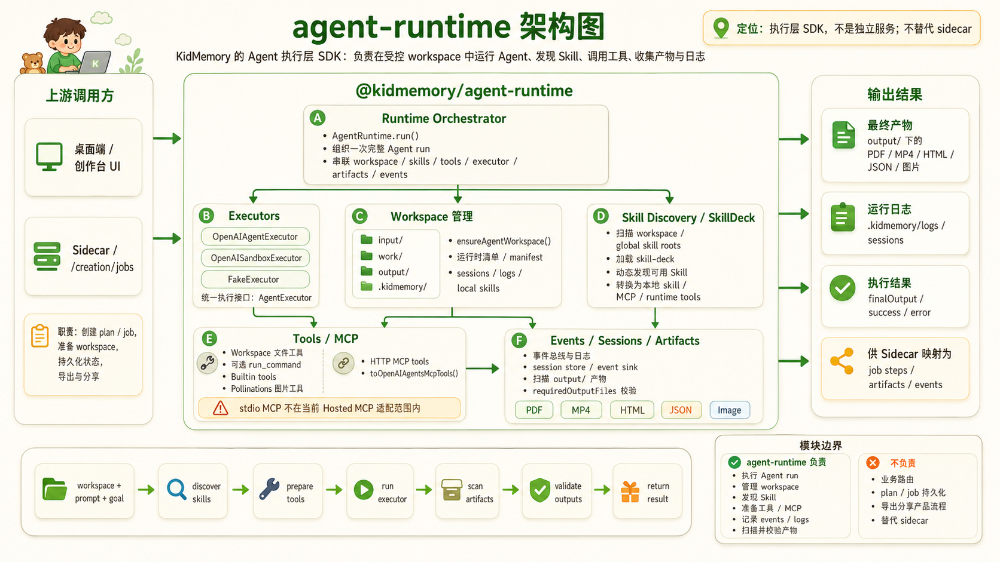

# @kidmemory/agent-runtime



`@kidmemory/agent-runtime` 是 KidMemory Generate 阶段的 SDK，负责把 workspace、Skill、工具和模型执行器组合成一条可闭环运行的 Agent 调用链。

它不提供业务路由，也不替代 Sidecar；它只负责”给定 workspace + prompt 的通用执行能力”。

## 它做什么

- 统一运行时核心：`OpenAI Agents SDK`，不使用 Vercel AI SDK。
- 支持两类执行器：
  - `OpenAISandboxExecutor`（`sandbox`）：OpenAI 官方或兼容能力的 sandbox 执行模式；
  - `OpenAIAgentExecutor`（`agent`）：用于 OpenAI-compatible provider 的普通 Agent + Runner。
- 通过 `executorKind: "sandbox" | "agent"` 或 `AGENT_RUNTIME_EXECUTOR=sandbox|agent` 切换。
- 最小输入是 `workspaceDir + prompt`，生成逻辑通过 `requiredOutputFiles`/事件与产物来判断成功与否。
- 通过动态发现加载 skill 和 MCP，并注入 runtime 可用工具。
- 所有执行日志与会话追踪写入 workspace 控制目录。
- 不提供 KidMemory 业务模型（如故事/视频结构）；只提供通用执行能力。

## 运行约束（关键行为）

- `run()` 的产出校验：
  - 可传 `requiredOutputFiles`，要求这些文件在 `output/` 下存在且非空；
  - 缺失会返回 `REQUIRED_OUTPUT_FILES_MISSING`，并记录在 session/log。
- `goal` 可选，未提供时 runtime 会基于 prompt 自动生成默认 goal。
- `input/` 只读；`work/` 仅中间文件；`output/` 为唯一 ArtifactScanner 扫描目录；`.kidmemory/` 存放控制面（sessions/logs/runtime）。
- `tool events` 会脱敏记录（`apiKey`、`token`、`secret`、`authorization`、`password` 等）。
- `data.loopControl` 会写入 `agent.run.finished/failed` 事件，便于复盘终止原因。

## 快速示例

```ts
import { AgentRuntime, type AgentRuntimeError } from "@kidmemory/agent-runtime";

const runtime = new AgentRuntime({
  provider: {
    model: process.env.OPENAI_MODEL,
    baseURL: process.env.OPENAI_BASE_URL,
    apiKey: process.env.OPENAI_API_KEY,
  },
  executorKind: "agent", // 或 sandbox
});

const result = await runtime.run({
  workspaceDir: "/path/to/examples/storybook",
  prompt: "生成 4 页儿童绘本草稿并写入 output/book.json 与 output/book.html",
  requiredOutputFiles: ["output/book.json", "output/book.html"],
});

if (!result.ok) {
  const error = result.error as AgentRuntimeError;
  console.error(`${error.code}: ${error.message}`);
}
```

## 包含的能力

### Workspace 与 skill

- 发现顺序包括：
  - `workspace/.kidmemory/skills`
  - `.kidmemory/manifest.json`
  - `~/.kidmemory/skills`
  - `~/.codex/skills`
- `SkillDeckProvider` 会把技能转换为 runtime 可调 tool，并对 `list_skills / read_skill / search_skills / skill_guide / use_skill_*` 可见。
- `ensureAgentWorkspace()` 会尝试把托管 skill（如 `picturebook-maker`、`hyperframes*`）初始化到 workspace 的 `.kidmemory/skills`（不覆盖已有同名 skill）。
- HTTP MCP 通过 `toOpenAIAgentsMcpTools` 注入到 Agents MCP tool 流。

### 工作区工具

- `sandbox`：默认不额外注入 workspace tool，依赖 OpenAI Sandbox 的内置 `filesystem + shell + compaction` 能力。
- `agent`：注入简版 workspace tools：
  - 默认注入 `list_files`、`read_file`、`write_file`、`edit_file`、`search_files`
  - `run_command` 默认关闭；只有调用方通过 `policy.tools.enableWorkspaceCommandTool` 显式开启时才注入
- 路径策略集中在 `tools/filesystem/path-policy.ts`，以保证只读/只写边界。

### 内置工具与外部能力

- 内置：`generate_storybook_image_with_pollinations`（输出至 `output/`，仅文本 prompt 输入，不接受图像 URL 等非文本输入）。
- 未内置 HyperFrames CLI tool；视频场景依赖 workspace/global skill 或外部 MCP。
- 支持 middleware：`beforeRun`、`beforeToolCall`、`afterToolCall`、`afterArtifactScan`、`onError`。

## Artifacts

`ArtifactScanner` 只扫描 `output/`，并支持：

- 文件 artifact：`json`、`html`、`mp4`、`image`、`text`
- 目录 artifact：`directory`
- `schemaRef`（调用方按 `localPath` 注入）
- `metadata.fileCount`（目录 artifact 文件数）

## 环境变量

### 通用

| 变量 | 是否必需 | 作用 |
| --- | --- | --- |
| `OPENAI_API_KEY` | 是（真实 provider/演示检查） | 模型鉴权 |
| `OPENAI_MODEL` | 是（真实 provider/演示检查） | 模型名 |
| `OPENAI_BASE_URL` | 否 | 覆盖 provider 基础地址 |
| `OPENAI_USE_RESPONSES` | 否 | 覆盖 OpenAI responses 开关 |
| `AGENT_RUNTIME_EXECUTOR` | 否 | `sandbox`（默认）/`agent` |
| `AGENT_RUNTIME_MAX_TURNS` | 否 | 最大对话轮数，默认 `30`，上限 `100` |
| `AGENT_RUNTIME_MODEL_CHECK_TIMEOUT_MS` | 否 | `check-model` 超时，默认 `30000ms`，上限 `120000ms` |
| `AGENT_RUNTIME_PROVIDER_CHECK_TIMEOUT_MS` | 否 | `check-provider` 超时，默认 `120000ms`，上限 `10min` |

### 绘本图片（可选）

| 变量 | 说明 |
| --- | --- |
| `IMAGE_API_URL` | Pollinations 入口（如 `https://image.pollinations.ai/prompt`） |
| `POLLINATIONS_IMAGE_BASE_URL` | 兼容旧配置 |
| `POLLINATIONS_IMAGE_MODEL` | 默认 `flux` |
| `POLLINATIONS_API_KEY` / `POLLINATIONS_TOKEN` | 通过 `Authorization: Bearer ...` 透传 |

## 命令

### 安装与校验

```bash
npm --prefix packages/agent-runtime install
npm --prefix packages/agent-runtime run build
```

### 环境与提供商检查

```bash
npm --prefix packages/agent-runtime run check-env
npm --prefix packages/agent-runtime run check-model
npm --prefix packages/agent-runtime run check-provider
```

- `check-env`：纯只读校验 env、workspace、skill 可见性，不改文件。
- `check-model`：真实 `chat/completions` 健康检查，不触发 workspace 读写。
- `check-provider`：真实执行最小输出任务，默认 sandbox；如需 `agent` 模式可用 `AGENT_RUNTIME_EXECUTOR=agent` 覆盖。

### Demo 相关

```bash
npm --prefix packages/agent-runtime run demo:prepare -- --preset storybook --workspace examples/storybook
npm --prefix packages/agent-runtime run demo:run -- --preset storybook --workspace examples/storybook --executor agent
npm --prefix packages/agent-runtime run demo:inspect -- --workspace examples/storybook
npm --prefix packages/agent-runtime run demo:prepare -- --preset video --workspace examples/video
npm --prefix packages/agent-runtime run demo:run -- --preset video --workspace examples/video --executor agent
npm --prefix packages/agent-runtime run demo:inspect -- --workspace examples/video
npm --prefix packages/agent-runtime run demo:inspect -- --workspace examples/provider-healthcheck
npm --prefix packages/agent-runtime run verify:demo
```

- `demo:prepare` 会清理 `work/output/.kidmemory/{sessions,logs}` 和旧 `input/assets`，保留 `skills`。
- `demo:inspect` 读取 `output`、session、event 与 trace 做状态快照。
- `verify:demo` 为真实闭环：先 `check-env` → `check-model` → `check-provider`，再跑 storybook/video 演练。

## 示例 Workspace

```text
workspace/
  storybook/
    .kidmemory/
      skills/
        storybook-demo-writer/
          SKILL.md
    input/
    work/
    output/
  video/
    .kidmemory/
      skills/
        video-demo-director/
          SKILL.md
    input/
    work/
    output/
```

- 这两个 `demo` skill 是示例 fixture，不是 SDK 内置业务逻辑。
- 真实接入方仍然只需要传 `workspaceDir` 与 `prompt`。

## Inspect 工具

`scripts/inspect-result.ts` 会输出：

- `output/` artifacts
- `.kidmemory/logs/events.jsonl` 事件统计
- `.kidmemory/sessions/*.jsonl` 会话 summary
- loopControl 停止原因
- `.latest.json` trace 引用

## 使用示例（API 片段）

```ts
const result = await runtime.run({
  workspaceDir,
  prompt,
  requiredOutputFiles: ["output/video.mp4"],
  goal: {
    objective: "生成一段纪念视频",
    completionCriteria: ["output/video.mp4 存在且非空"],
  },
  middleware,
});
```

`goal` 与 `requiredOutputFiles` 都是可选项；如不传则按默认策略执行。

## 常见约束与边界

- SDK 不约定 HyperFrames CLI 环境变量。
- 视频能力需要由 `.kidmemory/skills`/`~/.kidmemory/skills`/MCP 提供。
- 真实闭环检查依赖实际模型与 provider；本地测试需区分静态测试与真实调用。
- 若要最小化变更，优先从 `workspace` 级脚本开始验证，避免直接改写 core 流程。
