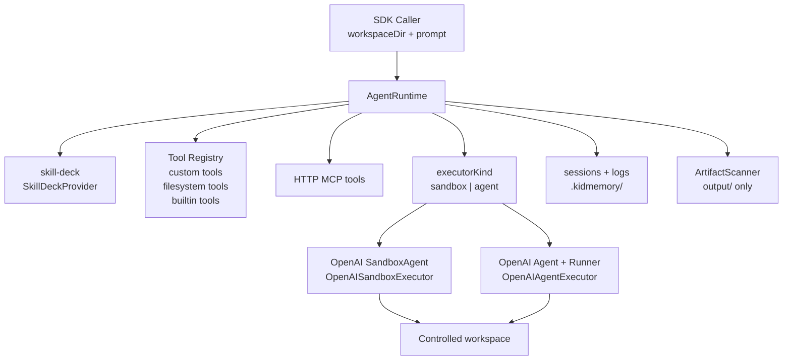

# KidMemory Agent Runtime 架构方案

`@kidmemory/agent-runtime` 是 KidMemory Generate 阶段的 package-level SDK。它不是 Sidecar 服务，也不拥有业务路由；调用方提供 `workspaceDir + prompt`，SDK 负责组合 AgentRuntime、skill-deck、工具、MCP 和 OpenAI Agents SDK executor。

## 核心边界

- `AgentRuntime` 是统一入口。
- `OpenAISandboxExecutor` 使用 OpenAI SandboxAgent，位于 `executors/sandbox`。
- `OpenAIAgentExecutor` 使用普通 Agent + Runner，位于 `executors/agent`。
- workspace file tools 位于 `tools/filesystem`。
- `sandbox` 模式依赖 SandboxAgent 原生 filesystem/shell/skills capability。
- `agent` 模式默认只注入 `list_files`、`read_file`、`write_file`、`edit_file`、`search_files`。
- `run_command` 是高风险能力，默认关闭，必须由调用方显式启用。
- HTTP MCP 可通过 hosted MCP adapter 接入；stdio MCP 当前不支持，会显式报错。
- HyperFrames 不作为 SDK 内置 tool；视频能力由 workspace/global skill、外部 MCP 或调用方 custom tool 提供。

## Workspace 协议

```txt
examples/storybook 或 examples/video
  .kidmemory/
    runtime.md
    manifest.json
    skills/
    sessions/
    logs/
  input/
  work/
  output/
```

`input/` 是只读上下文，`work/` 是中间草稿，`output/` 是唯一 artifact 扫描目录。`.kidmemory/` 保存 runtime 控制数据、session、logs 和 skill。

## Skill 发现

skill-deck 从以下位置按顺序聚合可用 skill：

- workspace `.kidmemory/skills`
- workspace manifest 中声明的 skill roots
- `~/.kidmemory/skills`
- `~/.codex/skills`

显式传入 `skillRoots` 时，它会作为 override 使用。

## 架构图


