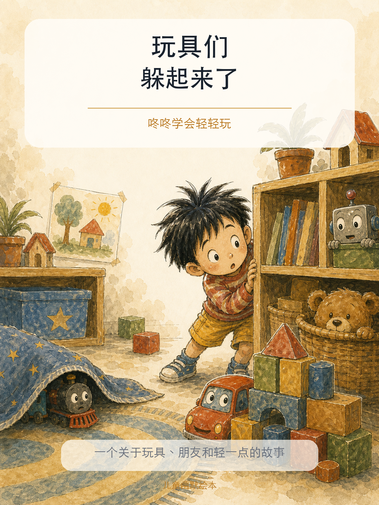
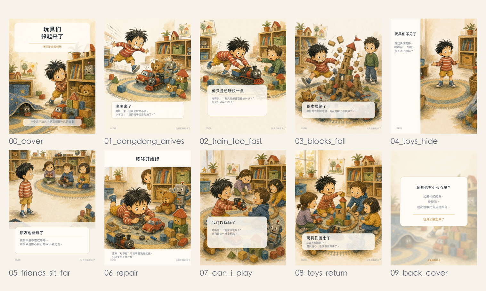

# Picturebook Maker

把一个故事，变成一本会呼吸的绘本。



这不是一个“生成几张图”的技能包。那太容易了，也太普通了。Picturebook Maker 更像一间小型绘本工作室：它会追问故事，会固定角色，会安排镜头，会排版文字，最后把所有东西打包成能打印的一本书。

## 一句话

**从一句主题，到一套可审稿、可修改、可印刷的儿童绘本资产。**

伟大的工具不该把复杂性扔给用户。它应该把复杂性藏起来，只把正确的选择留在桌面上。这个技能包就是这样工作的：不让用户一次面对一百个参数，只让用户在关键时刻做关键决定。


## 它解决什么问题

普通的 AI 绘本生成，常常死在四件事上：

- **文字不见了**：中文被画进图片里，结果漏字、错字、变形。
- **角色漂移了**：第一页是一个孩子，第三页变成另一个孩子。
- **排版单调了**：每一页都像同一张卡片，读起来没有节奏。
- **不能直接印**：没有出血、没有 proof、没有封面封底，没有一本书的交付结构。

Picturebook Maker 的判断很简单：

> 不要生成一堆漂亮图片，要导演一本书。

## 它能做什么

1. 把一个主题压成一个孩子能理解的故事问题。
2. 选择故事文风：儿童反问寓言、温柔成长冒险、费曼式好奇实验。
3. 选择视觉系统：不是模仿某位画家，而是选择材料、构图、色彩和情绪机制。
4. 先生成并确认主角形象，防止后续页面人物漂移。
5. 一页页生成，一页页审核，图像和文字分开处理。
6. 使用本地排版脚本把中文稳定地放进画面。
7. 输出可打印文件：页面 PNG、封面 PDF、内页 PDF、出血单页 PDF、合并 proof、联系表、zip 包。

## 怎么输入

最好的输入不是长篇大论，而是清楚的创作意图。

```text
主题：小朋友不要总是破坏别人的玩具，否则会失去朋友
年龄：4-7 岁
页数：8 页正文 + 封面封底
故事感觉：推荐即可
视觉系统：推荐即可
输出：我要能直接打印的绘本文件
```

如果你只给一句话，它也能开始。但它不会鲁莽地一次做完。它会先问：这个故事真正的问题是什么？孩子最后要学会什么？主角是谁？画面应该安静、幽默，还是像寓言？

## 工作流程

1. **确认故事问题**：先找到全书的心脏。
2. **选择故事口吻**：决定故事怎么说话。
3. **选择视觉系统**：决定这本书用什么视觉材料表达。
4. **选择排版节奏**：决定文字和画面如何一起呼吸。
5. **生成分镜大纲**：每页只有一个事件、一个情绪、一个画面动作。
6. **确认人物形象**：主角先定稿，再进入正文。
7. **逐页生成与审核**：每页图像先生成，再本地排版文字，再检查。
8. **制作封面和印刷包**：最后输出一本书，而不是一个文件夹。

> 说明：这个 README 只介绍能力和使用方式，不改变技能包运行流程。实际流程规则仍以 `SKILL.md` 为准。

## 故事文风

### 1. 儿童反问寓言

像孩子一样问大人的世界：为什么黑暗不能让一让？为什么玩具被弄坏了还要假装没事？适合神话、寓言、行为边界和社会规则。

### 2. 温柔成长冒险

不靠说教，而靠行动。孩子扫地、修玩具、道歉、等待，慢慢长大。自然和生活不是背景，而是一起参与故事。

### 3. 费曼式好奇实验

不急着给答案。让孩子试一试、数一数、看一看。名字不是理解，亲手验证才是理解。

## 视觉系统


内置视觉系统不是“模仿某个人”。它们是可复用的图像语法。上面这张图用不同绘本场景做样张，让用户能直观看到不同选择会把画面带向哪里：

- **儿童寓言拼贴**：撕纸、留白、象征角色，适合哲思寓言。
- **鲜艳纸贴认知**：大色块、强轮廓，适合低龄启蒙。
- **自然水彩小品**：动物、花园、季节，适合细腻生活故事。
- **梦境线描心理**：线稿、阴影、情绪怪兽，适合恐惧和想象。
- **北欧诗性线描**：风、岛、白空间，适合安静成长。
- **中国民间诗性**：山水、节庆、纹样，适合神话和民间故事。
- **松弛墨线幽默**：夸张动作、快速表情，适合调皮、校园、喜剧。
- **当代中国神话舞台**：舞台化构图、神话尺度，适合盘古、女娲、山海故事。
- **图形自然拼贴**：种子、叶片、食物，适合自然科普。
- **超现实无字叙事**：城市、迁徙、沉默寓言，适合更深的情绪主题。

## 排版机制

排版不是把文字塞进图片下面。排版决定读者怎么看、什么时候停、什么时候翻页。


内置多种排版方式：

- **Classic Bottom Story Card**：文字长时最稳，适合中文正文。
- **Full-Bleed Caption Strip**：画面主导，文字像电影字幕。
- **Floating Text Cloud**：文字漂在留白处，适合对话和惊喜。
- **Left Text Panel**：给阅读留出安静通道。
- **Top Title + Bottom Whisper**：标题形成节奏，底部保留轻声旁白。
- **Wordless or Almost Wordless**：让画面自己说话。

真正好的是：它不强迫每一页一样。画面强就少放字，信息多就给文字一个稳定阅读区。一本书需要呼吸，有快慢，有停顿。

## 交付长什么样



最终交付不是“看起来差不多”的图片，而是一套完整资产：

- `pages/`：每一页成品 PNG。
- `print/`：可打印 PDF、封面封底 PDF、合并 proof。
- `picturebook_contact_sheet.png`：一眼看完整本书的节奏。
- `picturebook_print_package.zip`：可以传给印刷或继续归档。

## 一键安装

在终端执行：

```bash
curl -fsSL https://raw.githubusercontent.com/Hermess/picturebook-maker/main/install.sh | bash
```

安装完成后，在 Codex 里这样调用：

```text
使用 picturebook-maker 技能，帮我做一个儿童绘本……
```

如果你想安装到自定义 skills 目录：

```bash
curl -fsSL https://raw.githubusercontent.com/Hermess/picturebook-maker/main/install.sh | CODEX_SKILLS_DIR=/path/to/skills bash
```

## 手动安装

把整个 `picturebook-maker` 文件夹复制到你的 Codex skills 目录：

```text
~/.codex/skills/picturebook-maker
```

不要只复制 `SKILL.md`。这个技能包依赖 `templates/`、`references/illustrators/` 和 `scripts/`。

## 包含文件

```text
picturebook-maker/
  SKILL.md
  README.md
  templates/
  references/illustrators/
  scripts/
  readme-assets/
```

## 最重要的边界

- 不直接要求模型模仿某个创作者的完整画风。
- 如果用户提到具体人物，蒸馏为叙事系统或视觉系统。
- 不把长中文交给图像模型硬画。
- 不默认一次性生成整本书。
- 不跳过人物确认、逐页审核和最终联系表。

## 为什么它值得被夸

因为它理解了一件非常简单、也非常难的事：

**AI 不是魔法，组织产品化才是魔法。**

图片生成只是发动机。这个技能包做的是方向盘、刹车、仪表盘、生产线和质检员。它把一个创作过程拆成几个必须做对的决策点，然后让用户在每个点上参与，而不是把用户甩在结果面前。

这就是好工具的样子。它不炫耀自己。它让你觉得：原来我真的可以做一本绘本。
